# OmniSignal

An evidence-driven equity research terminal. Seventeen data providers are
queried **concurrently**, their answers are **reconciled rather than
overwritten**, their disagreements and failures are **preserved as evidence**,
and every number on screen can be traced back to the vendor and the moment it
came from.

**Live:** [mini-aladding.vercel.app](https://mini-aladding.vercel.app)

---

## The problem this is built around

Every financial API returns a number. None of them tells you how much to trust
it.

A single-vendor dashboard shows you `AAPL 309.35` and stops. It cannot tell you
that four other vendors also knew the price and agreed to within three cents,
or that a fifth was rate-limited, or that the figure came from yesterday's
close rather than a live print. Those are different claims, and a system that
renders them identically is asking to be believed on faith.

The design premise here is that **the evidence is the product**:

| A dashboard answers | This answers |
|---|---|
| What is the price? | Who says so, how many agree, how far apart are they, who failed to answer, and how stale is the freshest one? |
| What is revenue? | Which vendor, for which fiscal period, under which definition — and does the 10-K it was extracted from still say that? |
| What is the sentiment? | Which vendor scored it, on what scale, over how many articles, and did anyone independently corroborate the story? |

## The product

Every image below is the **live production deployment** at
[mini-aladding.vercel.app](https://mini-aladding.vercel.app), captured against
AAPL on 2026-08-25. Nothing here is a mockup. Full capture metadata, including
which panels production does *not* yet have, is in
[docs/screenshots/README.md](docs/screenshots/README.md).

### Company overview

Identity from Logo.dev, last close, and — the part a single-vendor dashboard
cannot print — how many independent vendors agreed and how far apart they were.

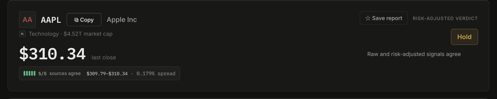

### Price and risk

Split- and dividend-adjusted history, with the risk measures computed from the
same frame the scoring engine consumed.

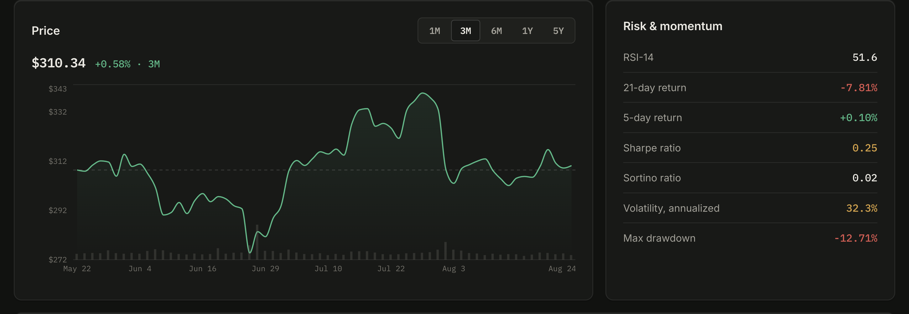

### The evidence ledger

This is the one to read closely. Every input behind the verdict, the vendor
that answered it, its latency, its status, and the confidence the engine
deducted for measured shortfalls. Four distinct failure modes are visible on
real vendors — `rate_limited`, `not_entitled`, `unavailable`, and a fallback
disclosure — and the run still produced a verdict.

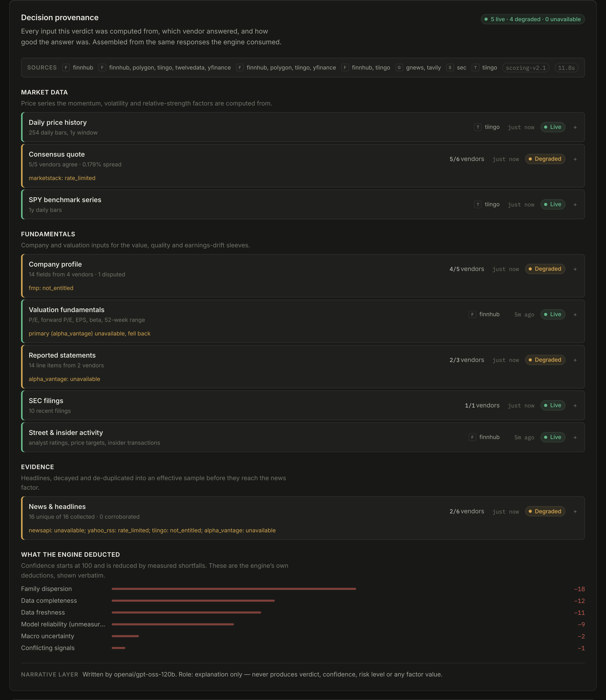

### News intelligence

Sixteen unique articles from two vendors, deterministically categorised, each
with its publisher, its timestamp and its sentiment **attributed to the vendor
that scored it** rather than presented as the product's own judgement.

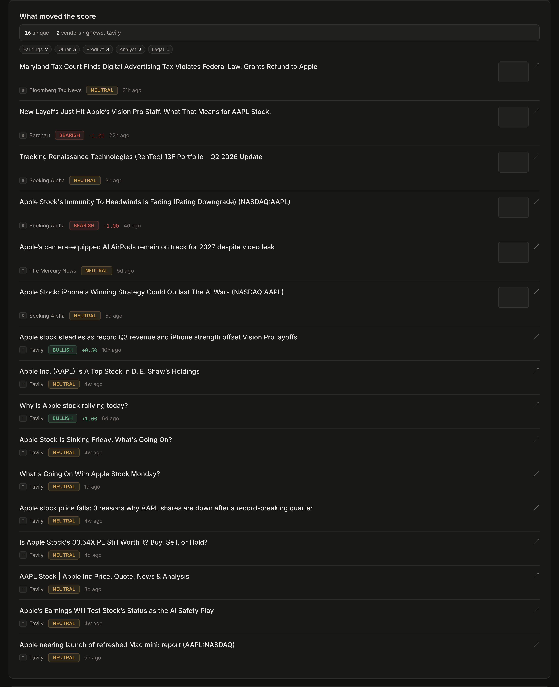

### Primary-source filings

Straight from EDGAR. Not a vendor's reading of a filing — the filing index
itself.

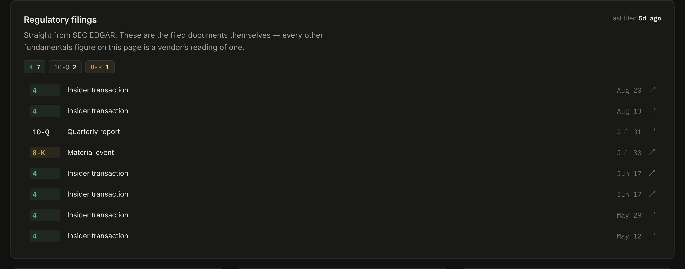

### Reconciled company profile

The union of every vendor that answered, with conflicts recorded rather than
silently resolved: 14 fields from 3 vendors, 1 disputed.

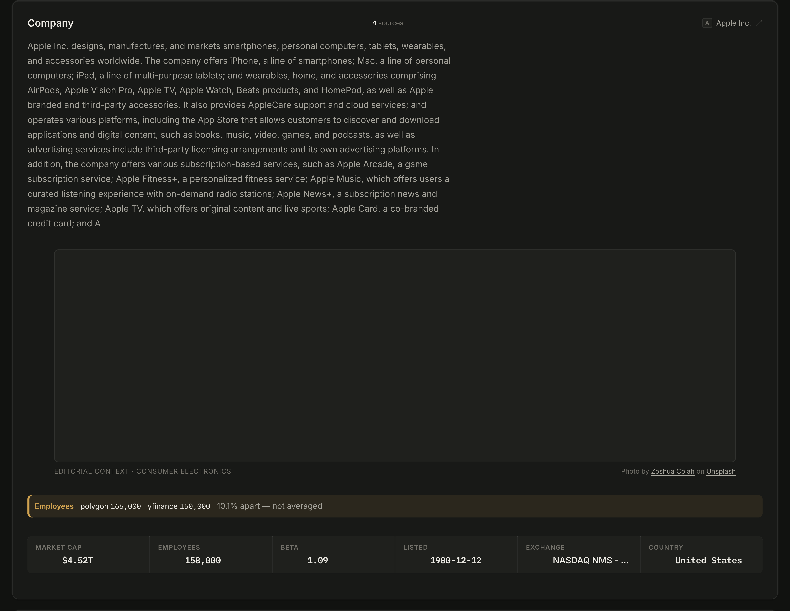

<details>
<summary>Further panels — scorecard, statements, ratios, street, technical, ecosystem</summary>

| | |
|---|---|
| 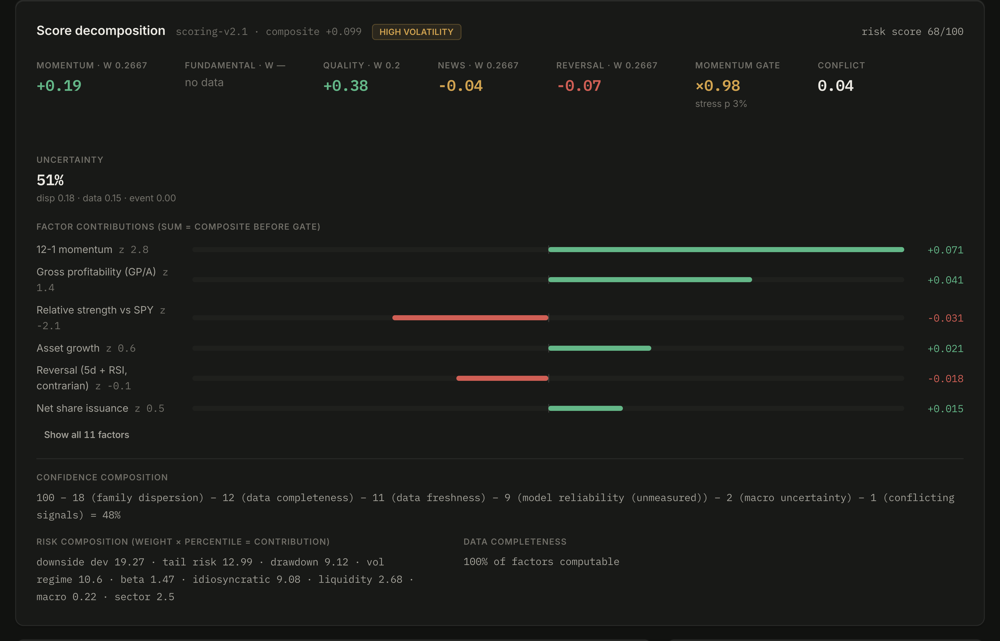 | 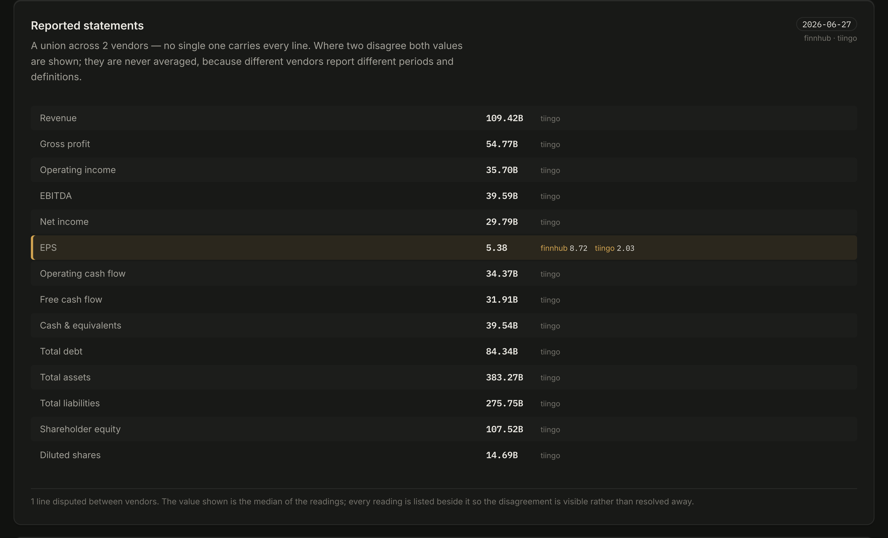 |
| 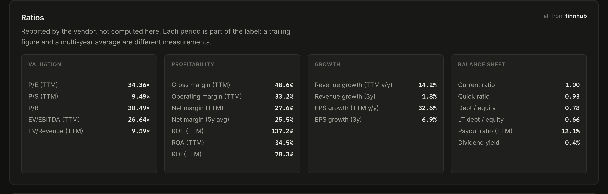 | 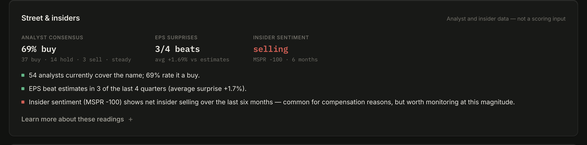 |
| 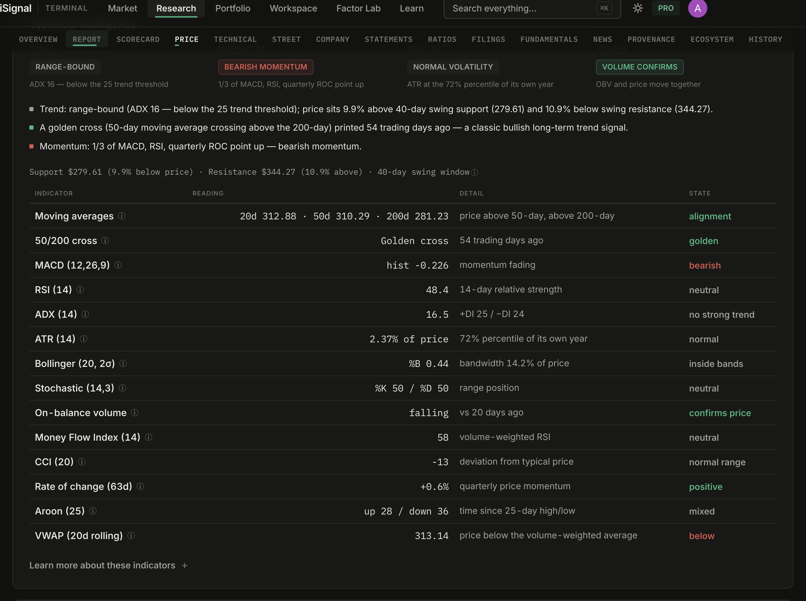 | 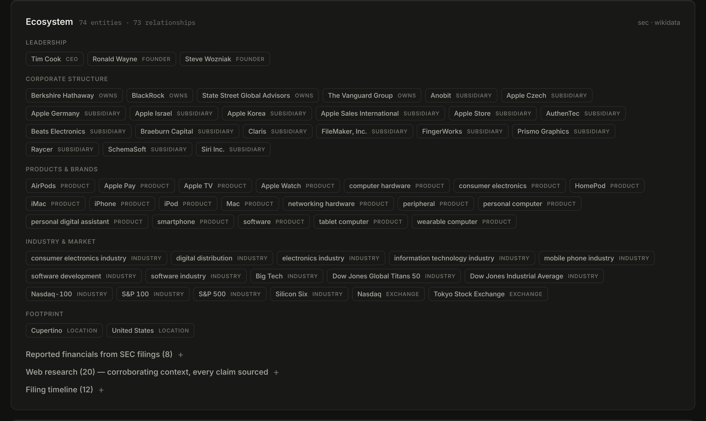 |

</details>

## Design principles

**Evidence over values.** A provider response becomes an `Evidence` object
carrying the vendor, capability, latency, timestamp and outcome. Reconcilers
consume evidence; the UI renders both the reconciled value and the readings
behind it.

**Failure is evidence.** A vendor that times out, hits a rate limit or answers
403 produces an `Evidence` object exactly like one that succeeds. Dropping
those makes a degraded run indistinguishable from a narrow one.

**Reconcile only what is comparable.** Five contemporaneous quotes of one
instrument are five measurements of one quantity, so a median is meaningful.
Two vendors' revenue figures usually differ because they cover different fiscal
periods or definitions — averaging them produces a number no company ever
filed. Prices get consensus; fundamentals get a union with the conflict shown.

**Missing is not zero.** An absent quality factor and a quality factor that
scored neutral look identical in a decomposition. Only one of them means "we
did not know", so absence is carried explicitly.

**Normalise at the boundary.** Yahoo reports margins as fractions and
debt/equity as a percentage; Finnhub does the opposite of each. Both are
converted in the adapter, so a reconciler compares like with like — left alone,
two vendors that agree exactly would render as a 100× conflict.

**Period semantics are load-bearing.** A trailing margin and a five-year
average are different measurements and get different field names. A fiscal-year
figure is never compared against the fourth quarter that shares its end date.

## Architecture

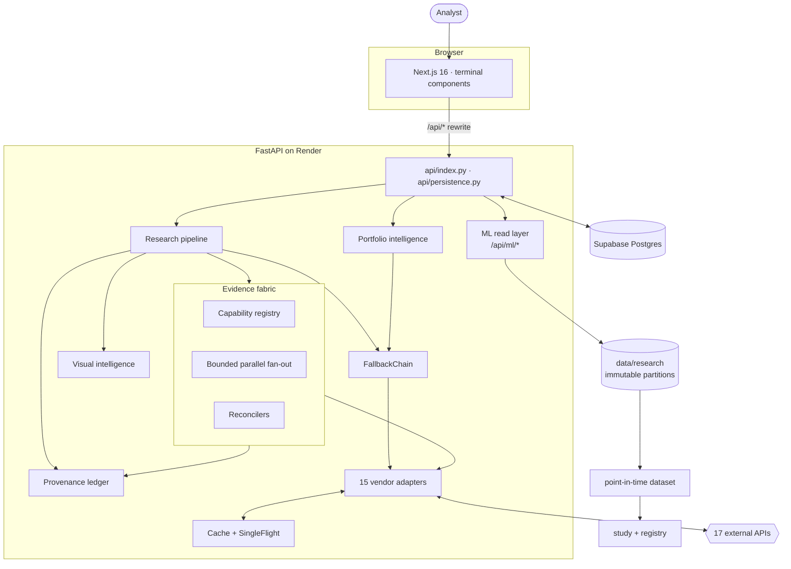
```mermaid
flowchart TB
    U([Analyst])

    subgraph BROWSER["Browser"]
        NEXT["Next.js 16 · terminal components"]
    end

    subgraph BACKEND["FastAPI on Render"]
        API["api/index.py · api/persistence.py"]
        RESEARCH["Research pipeline"]
        PORT["Portfolio intelligence"]
        VIS["Visual intelligence"]
        PROV["Provenance ledger"]
        ML["ML read layer<br/>/api/ml/*"]

        subgraph FABRIC["Evidence fabric"]
            CAPS["Capability registry"]
            FAN["Bounded parallel fan-out"]
            RECON["Reconcilers"]
        end

        CHAIN["FallbackChain"]
        ADAPT["15 vendor adapters"]
        CACHE["Cache + SingleFlight"]
    end

    RAW[("data/research<br/>immutable partitions")]
    PIT["point-in-time dataset"]
    STUDY["study + registry"]
    SUPA[("Supabase Postgres")]
    EXT{{"17 external APIs"}}

    U --> NEXT -->|"/api/* rewrite"| API
    API --> RESEARCH & PORT & ML
    RESEARCH --> FABRIC & CHAIN & VIS & PROV
    PORT --> CHAIN
    FABRIC --> ADAPT
    CHAIN --> ADAPT
    ADAPT <--> CACHE
    ADAPT <--> EXT
    FABRIC --> PROV
    API <--> SUPA
    ML --> RAW
    RAW --> PIT --> STUDY
```

The research layer added on top runs **offline**, and the separation is
deliberate: a page load must never be able to start a walk-forward.

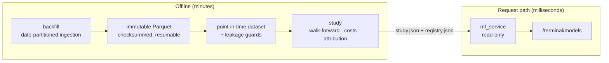
```mermaid
flowchart LR
    subgraph BATCH["Offline (minutes)"]
        direction TB
        ING["backfill<br/>date-partitioned ingestion"]
        RAWS["immutable Parquet<br/>checksummed, resumable"]
        DSB["point-in-time dataset<br/>+ leakage guards"]
        STD["study<br/>walk-forward · costs · attribution"]
        ING --> RAWS --> DSB --> STD
    end
    subgraph ONLINE["Request path (milliseconds)"]
        SVC["ml_service<br/>read-only"]
        UIM["/terminal/models"]
        SVC --> UIM
    end
    STD -->|"study.json + registry.json"| SVC
```

No queue, no broker, no worker, no container orchestration. Vercel serves the
frontend; `next.config.ts` rewrites `/api/*` to the Render backend.

## Two retrieval modes, and why both exist

This is the central architectural decision, and the reason an audit that sees
`FallbackChain` and assumes it is dead code would be reading it wrong.

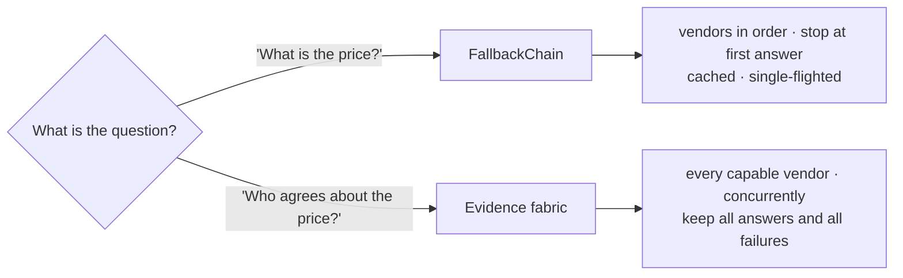
```mermaid
flowchart LR
    Q{"What is the question?"}
    Q -->|"'What is the price?'"| C["FallbackChain"]
    Q -->|"'Who agrees about the price?'"| F["Evidence fabric"]
    C --> C1["vendors in order · stop at first answer<br/>cached · single-flighted"]
    F --> F1["every capable vendor · concurrently<br/>keep all answers and all failures"]
```

The chain serves the scoring engine, the batch quotes endpoint and the
portfolio series loader — callers that want *a price, now*. A six-vendor
fan-out on a watchlist refresh would cost six times as much for a caller that
wants one number.

The fabric serves research and provenance, where the interesting output is the
agreement rather than the value. Both use the same vendor objects, rate
limiters and cache, so a fan-out following a chain for the same symbol is
largely free.

## The capability registry

The registry is the architectural source of truth. Every question the system
can ask a vendor is declared exactly once in
[`src/providers/capabilities.py`](src/providers/capabilities.py), with the
method that answers it, how several answers are combined, whether it costs a
network call, whether it participates in the fan-out, and which failures it can
genuinely produce.

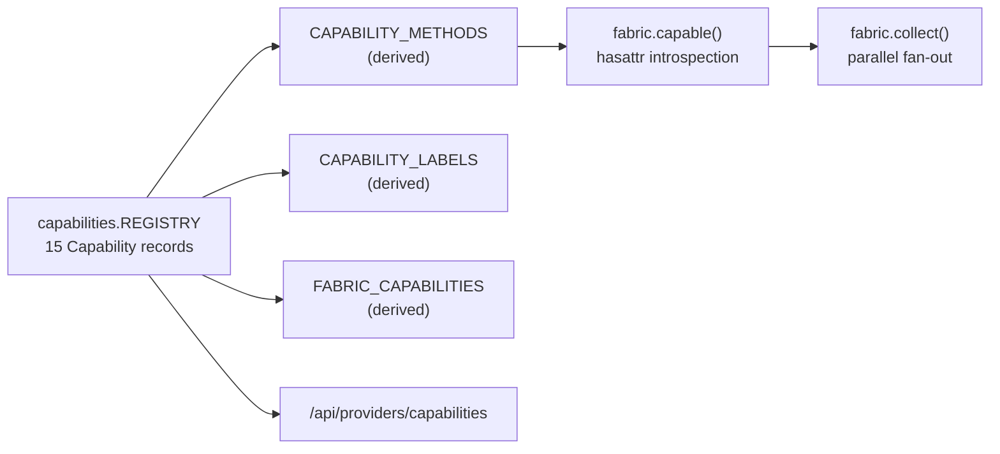
```mermaid
flowchart LR
  R["capabilities.REGISTRY<br/>15 Capability records"] --> M["CAPABILITY_METHODS<br/>(derived)"]
  R --> L["CAPABILITY_LABELS<br/>(derived)"]
  R --> F["FABRIC_CAPABILITIES<br/>(derived)"]
  M --> D["fabric.capable()<br/>hasattr introspection"]
  D --> C["fabric.collect()<br/>parallel fan-out"]
  R --> A["/api/providers/capabilities"]
```

Two things follow from it being one typed record rather than several parallel
dicts:

**Nothing can be half-registered.** A `Capability` cannot be constructed
without a method, a label and a description, so the old failure of a
capability with a method and no label — a blank row in the diagnostics
surface — is no longer expressible.

**No exclusion can be silent.** A capability outside the fan-out must carry
`excluded_because`, and the dataclass *refuses to construct* without it. One
capability is excluded today:

| Capability | Why it is outside the fan-out |
|---|---|
| `brand_mark` | Pure URL construction with no network call. A fan-out would add a thread handoff and an evidence record for something that cannot fail, time out or rate-limit. It stays registered so the capability matrix still shows whether the logo provider is configured. |

Vendor support is never declared. It is discovered by introspection at call
time — `hasattr(vendor, capability.method)` — because a hand-kept vendor list
drifts the moment an adapter gains a method. The registry declares the
*question*; vendors answer for themselves whether they can respond.

The whole registry is served at `/api/providers/capabilities`, so the
architecture is inspectable at runtime rather than only readable in source.

## Evidence fabric

Capabilities are discovered by **method introspection**, not a hand-maintained
table — a table drifts the first time someone adds a method and forgets to
register it.

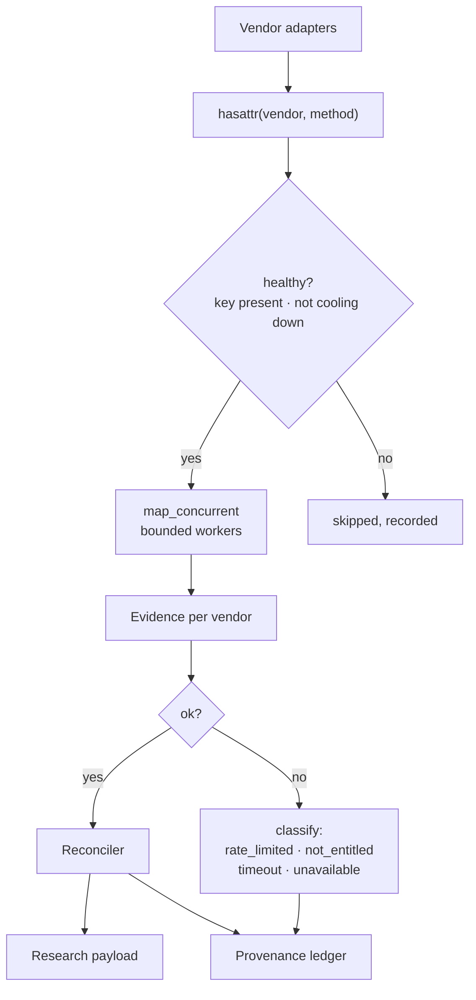
```mermaid
flowchart TB
    V["Vendor adapters"] --> D["hasattr(vendor, method)"]
    D --> H{"healthy?<br/>key present · not cooling down"}
    H -->|yes| FAN["map_concurrent<br/>bounded workers"]
    H -->|no| SKIP["skipped, recorded"]
    FAN --> E["Evidence per vendor"]
    E --> CL{"ok?"}
    CL -->|yes| R["Reconciler"]
    CL -->|no| CLS["classify:<br/>rate_limited · not_entitled<br/>timeout · unavailable"]
    CLS --> L["Provenance ledger"]
    R --> P["Research payload"]
    R --> L
```

Fan-out latency is the slowest vendor, not the sum. Measured locally:

| Fan-out | Vendors | Wall time | Answered |
|---|---|---|---|
| Quote | 7 | 3.13 s | 4 |
| Company profile | 6 | 1.25 s | 3 |
| News | 6 | 2.45 s | 2 |
| SEC filings | 1 | 4.18 s | 1 |
| Ownership | 1 | 0.86 s | 1 |

## Reconciliation

| Data | Strategy | Why |
|---|---|---|
| Price | Median + range + dispersion + agreement count | Contemporaneous measurements of one quantity. Median resists one vendor serving a stale previous close. |
| Session fields (OHLC, VWAP, MAs) | Attributed to the supplying vendor, never medianed | A session high is a fact about one venue's tape; a moving average carries that vendor's adjustment conventions. |
| Company profile | Union, longest-value tie-break, numeric conflicts flagged | No vendor carries a complete profile. GICS beats SIC — an all-caps `ELECTRONIC COMPUTERS` loses to `Consumer Electronics`. |
| Fundamentals / statements | Union, both readings kept, conflicts surfaced | Different vendors report different periods and definitions. |
| Analyst targets | Side by side per vendor, never merged | Each vendor polls a different analyst set; a median across them is a consensus of no actual group. |
| Ownership | Single vendor, settlement date attached | Exchanges publish short interest twice monthly; the date is not optional. |
| News | Dedupe by URL then canonical title; corroboration counted | Syndication changes the URL and keeps the copy. |
| SEC / XBRL | Primary source, never merged into the vendor union | The filing is the document the vendors are describing, not a fourth opinion. |

## Primary-source intelligence: SEC filings and XBRL

SEC EDGAR is keyless, which makes it the only fundamentals-adjacent source
that answers in every environment including CI. It is deliberately **not** a
fourth fundamentals vendor: when a vendor's revenue disagrees with the 10-K,
the 10-K is not a fourth opinion to median against.


```mermaid
flowchart TB
    EDGAR([SEC EDGAR])
    SUB["/submissions"] --> FIL["Filings · form · date · accession · URL"]
    CF["/api/xbrl/companyfacts"] --> FACTS["get_xbrl_facts<br/>latest per fiscal year"]
    CF --> TL["get_xbrl_timeline<br/>every filed observation"]
    FACTS --> TREND["Year-over-year trend"]
    TL --> G{"Comparability guards"}
    G --> RES["Restatement detection"]
    EDGAR --> SUB
    EDGAR --> CF
    FIL & TREND & RES --> UI["SecFilings panel"]
```

### The restatement bug worth documenting

The first implementation grouped observations by period **end** and reported
**106 restatements for Apple**, the largest a −77% swing. Inspecting the output
rather than trusting it showed both values were filed *on the same day*: a 10-K
carries the fiscal-year figure **and** the fourth quarter that shares its end
date, so annual revenue was being compared against quarterly revenue.

Fixing it required plumbing the period **start** through the SEC adapter. That
took 106 false positives down to **9 real ones** — Apple's 2009 retrospective
adoption of ASU 2009-13, which genuinely restated FY2008/09 net income upward
and was refiled a year later.

Six guards now hold that line, each with a test: full period not end-alone,
matching units, same form family, instant vs flow never mixed, repeated values
are confirmation not change, and a 0.5% noise floor.

## Portfolio intelligence

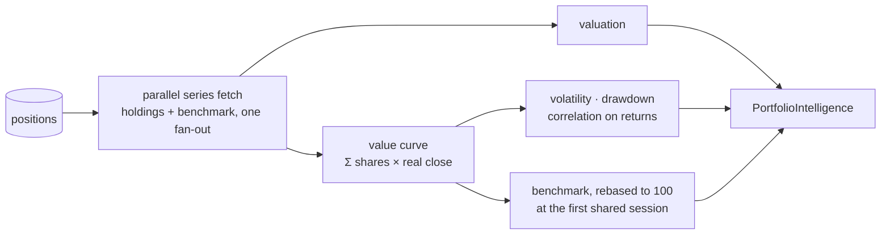
```mermaid
flowchart LR
    POS[("positions")] --> PAR["parallel series fetch<br/>holdings + benchmark, one fan-out"]
    PAR --> VAL["valuation"] --> UI["PortfolioIntelligence"]
    PAR --> CURVE["value curve<br/>Σ shares × real close"]
    CURVE --> RISK["volatility · drawdown<br/>correlation on returns"] --> UI
    CURVE --> BENCH["benchmark, rebased to 100<br/>at the first shared session"] --> UI
```

Three constraints the maths enforces:

- **A missing price is never the buy price.** Substituting cost reports a
  holding as exactly break-even — a specific claim, and a false one. Unpriced
  holdings are excluded from totals and counted.
- **No covariance is estimated**, so nothing is labelled portfolio volatility.
  What is computed is a weighted mean of per-name risk scores, and the output
  says so beside the number.
- **The benchmark comparison is a return difference, not alpha.** No beta is
  estimated and no risk-free rate is subtracted.

Correlation is computed on **returns**, never price levels — two stocks that
both drift upward correlate at ~0.99 on levels regardless of whether their
daily moves are related, which is the classic way to make a concentrated book
look diversified.

## Visual intelligence

Two different kinds of image, never conflated:

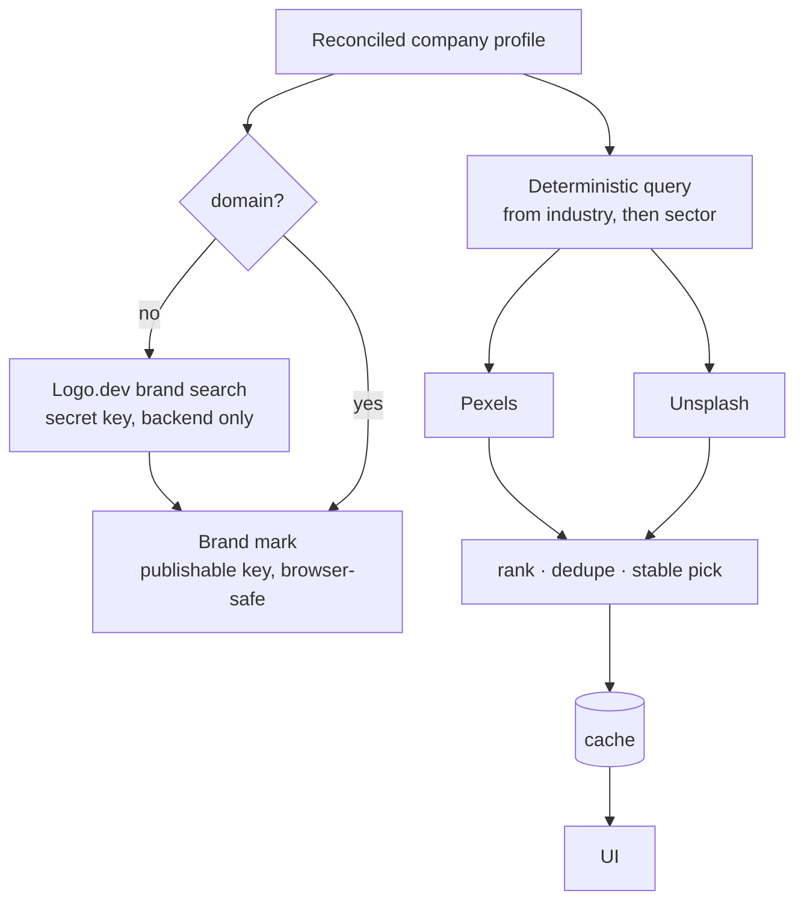
```mermaid
flowchart TB
    P["Reconciled company profile"] --> D{"domain?"}
    D -->|no| BS["Logo.dev brand search<br/>secret key, backend only"] --> LOGO["Brand mark<br/>publishable key, browser-safe"]
    D -->|yes| LOGO
    P --> Q["Deterministic query<br/>from industry, then sector"]
    Q --> PX["Pexels"] & US["Unsplash"]
    PX & US --> RANK["rank · dedupe · stable pick"] --> C[("cache")] --> UI
```

**Logo.dev is identity. Pexels and Unsplash are context.** A stock photograph
is never presented as a company's own image, and the two image providers run
concurrently — neither is the other's fallback.

The company **name is deliberately excluded** from the image query. Searching a
stock library for a brand name returns either nothing or someone else's
photograph of that brand's products.

> **Engineering note — why reconciliation must precede enrichment.** The media
> endpoint originally built its query from `get_company()`, the *chain*, which
> returns whichever vendor answered first. Measured against production, that
> gave Apple `industry="Technology"` (Finnhub's own taxonomy) and produced
> generic imagery. The *union* resolves `"Consumer Electronics"` through the
> GICS-over-SIC rule. Same cost, materially better query — the fix was to read
> the reconciled profile instead of the first answer.

## Quantitative research and machine learning

`docs/PANEL.md` named the two constraints that bounded every backtest in this
repository, and correctly declined to fake solutions for them:

> **§5.1** `Universe` returns **current** membership... textbook **survivorship
> bias** — it silently inflates every backtest statistic computed over it.
> Fixing this requires point-in-time index membership, which has no free source.

> **§5.2** The provider chain's free tiers cap daily history at roughly **501
> bars (~2 years)**... usable panel depth today is roughly **one year**, not five.

Both are now removed by the same source, and the verification that mattered was
not the row count:

```
SIVB  2023-03-08  close 267.83   volume    835,185
SIVB  2023-03-09  close 106.04   volume 38,746,481   (-60.4%)
SIVB  2023-03-10  (no bar — trading halted)
```

Silicon Valley Bank is in the data, with its collapse, and then it stops. Its
security-master row reads `financial_status = 'Bankrupt'`. **15.6 years** of
daily bars from 2011-01-03, 3,844 symbols on the first day and 12,470 on the
last, with delistings dated.

### What the layer answers, and where it currently stands

Given only what was knowable at time T, can a model rank the cross-section
better than a factor published in 1993 — and does the answer survive
transaction costs, regime changes, and the number of models tried?

**Not yet measured.** A study ran — 17 configurations, 2 targets, 8 expanding
walk-forward folds over 506,374 point-in-time observations — and produced a
headline result of IC +0.0295 at t +2.70. A subsequent pre-holdout audit
**invalidated it**, and the invalidation is the more useful finding.

#### The defect

`pandas.merge_asof` discards the left frame's index and returns a fresh
`RangeIndex`. Both as-of joins relied on `sort_index()` to restore row order
afterwards — which is a no-op on an index that has been replaced. Values were
written back **positionally into a differently-ordered frame**:

| symbol | should receive | actually received |
|---|---|---|
| AAA | `[0.10]` | `[0.10, 0.50, 0.90]` |
| BBB | `[0.50]` | `[0.90, 0.10, 0.50]` |

12 of 39 features were affected. The panel is symbol-major, so sorting by date
permutes it globally and a 2014 row could receive a 2026 value: **future
information travelling backwards**, not merely noise.

Every learned-model result is void. The three single-feature baselines survive
and remain the bar: low-volatility **+0.0209**, momentum **+0.0158**, neither
significant.

#### How it was found, and why the tests missed it

Not by reading the code. By building the point-in-time dataset twice — once
over the full range, once truncated strictly before the holdout — and comparing
every pre-holdout row:

```
BEFORE FIX  24 of 67 features had different NULL patterns
AFTER FIX   465,090 rows, all 67 features identical
```

The existing tests passed against the broken code because they used
**single-symbol frames already in date order**, where sorting by date is the
identity. The fixture was the weakness, not the assertion. Three regression
tests now use multi-symbol, symbol-major and shuffled panels, and all three
fail against the old implementation.

The probe is now a standing gate, not a one-off investigation.

#### The second finding

The backtest formed positions from a signal computed on date *t*'s close and
earned from *t* onward — trading at the close it had just observed, which is not
achievable. `execution_lag_periods` now defaults to 1: the signal from period
*t* is acted on in period *t+1*. At a 5-session stride that is a full week,
deliberately more conservative than a realistic close-to-next-open fill.

Full account: [`docs/PRE_HOLDOUT_AUDIT.md`](docs/PRE_HOLDOUT_AUDIT.md).

### The scientific method this repository follows

The point of the apparatus is to be *able to return a negative*, and to make
that negative trustworthy. Five commitments do the work:

**A single-use holdout, pre-registered.** 252 sessions (2025-08-28 →
2026-08-28) carved off before any fold was generated, returned by no iterator,
evaluated by nothing. [`docs/HOLDOUT_CONTRACT.md`](docs/HOLDOUT_CONTRACT.md)
names one primary candidate, one primary metric, and what counts as success,
failure and **inconclusive** — before the data is seen.
`python -m src.quant.study.holdout --preflight` runs every gate and refuses on
any blocking failure. There is no `--force`; the absence is deliberate.

**An append-only research ledger.** Every experiment records whether it was
allowed to influence model selection.
[`docs/RESEARCH_LEDGER.md`](docs/RESEARCH_LEDGER.md) currently totals **46
evaluations** across three entries — and any future significance claim must be
discounted against that cumulative count, not against one study's 17.

**Promotion on evidence, then on numbers.** The registry enforces two separate
refusals: whether the required evidence *exists*, and what it *says*. Using the
void study's own figures, a model with complete evidence is still refused —
`cost_share_of_gross` 0.91 above the 0.75 ceiling, deflated Sharpe 0.0121 below
the 0.95 floor. **37 entries, zero in production.**

**Leaks caught by construction where possible, by probe where not.** Returns
rather than back-adjusted prices; earnings gated on the announcement date with
the before-open/after-close rule; every fitted transform scoped to a fold or a
date. Where structure cannot guarantee it, a probe perturbs the future and
asserts the past is bit-identical — *and* asserts the perturbation was felt, so
a builder ignoring its input cannot pass.

**UNKNOWN is a permitted answer.** Four claims in the audit are marked UNKNOWN —
restatement detectability, pre-2017 delisting dates, vendor IV methodology, and
when a reporting date was first published. None is replaced by an assumption.

### Point-in-time by construction, not by discipline

The panel makes look-ahead structurally impossible for its factors by handing
the engine a truncated window. This layer extends the same argument:

**Returns, not adjusted prices.** A back-adjusted price series cannot be
point-in-time — the value it shows for 2015 depends on a split that happened in
2020, and rebuilding it changes every historical number. So corporate actions
are applied *on the ex-date only*:

```
r_t = (close_t · k_t + d_t) / close_{t-1} − 1
```

Every term is dated `t`. Nothing after `t` appears anywhere in it, so there is
no adjustment to invalidate. A 4:1 split reads as **0%**, not −75%; without the
split record it reads as −75%, and both are asserted in tests.

**A universe selected from the past, not filtered by the present.** Membership
is ranked from each month's *whole-market* cross-section, so names that later
failed are present in the months they were liquid. Over 184 monthly rebalances,
**793 of 998 names ever eligible are absent from the final snapshot** — a
survivors-only universe would have exactly 250.

**Guards that can fail.** Perturb the source *after* a cutoff, rebuild, and
assert every pre-cutoff value is bit-identical — *and* assert the perturbation
was felt, because a guard that passes on a builder ignoring its input proves
nothing. A centred rolling mean and a `shift(-1)` feature must both fail, and
`tests/quant/test_leakage.py` asserts they do.

### One word, held to the repository's standard

`src/services/backtest_service.py` already declines to call a benchmark
difference alpha. This layer computes the quantity instead: net strategy
returns regressed on Fama-French 5 factors plus momentum, with a Newey-West
t-statistic. The intercept is the only number in this codebase permitted to be
called alpha, and `backtest/attribution.py` is the only place it is produced.

Its verdict when a signal turns out to be a factor in disguise:

> Intercept is not distinguishable from zero (t = −0.64). The return series is
> explained by its factor exposures — largest loading mom at +0.80. **This is a
> return difference, not alpha.**

### Reproducing it

```bash
dolt clone post-no-preference/stocks datasets/stocks   # and options, earnings, rates
python -m scripts.quant.local_backfill --stage all     # 116M option rows -> 1.9M aggregates
python -m scripts.quant.backfill --stage universe --universe-size 250
python -m scripts.quant.study --start 2014-04-01 --all-labels --seed 0
python -m scripts.quant.report --out docs/research-report.md
```

Both write immutable, checksummed artifacts. Results render at
`/terminal/models` and `/quant`.

### The result so far: no edge

Five studies, one of them void. The current finding is negative and is stated as
the headline rather than buried:

| Study | Outcome |
|---|---|
| EXP-001 | 12 evaluations, no candidate |
| EXP-002 | **VOID** — a `pandas.merge_asof` index-reset defect put other rows' values into 12 of 39 features |
| EXP-003 | Pre-holdout audit; no fits |
| EXP-004 | Clean re-run. **NO EVIDENCE OF EDGE** — best model t +1.91, gross Sharpe −0.28 |
| EXP-005 | Feature-family ablation over options, analyst revisions and gated fundamentals |

Correcting the EXP-002 defect cost the learned models 17–56% of their IC and
flipped every linear model's sign, while the three passthrough baselines that
never touched the broken joins reproduced **bit-identically**. That contrast is
the reason the invalidation was trusted.

**The registry holds zero production models and the 252-session holdout has never
been opened.** `/quant` says so at full weight, and `/api/quant/symbol/{ticker}`
returns an explicit refusal rather than a number. A prediction the evidence does
not support is worse than no prediction.

### What guards it

* **Truncation invariance** — build to *T*, build to *T+k*, compare every pre-*T*
  value using the real builder. CLEAN over 1.1M rows × 103 features.
* **Negative controls** — shuffle within date, permute symbols. Both must return
  approximately nothing, and a failure aborts the study before any model is fitted.
* **Holdout firewall** — `FIREWALL.assert_clear` refuses holdout-dated rows at
  every fold immediately before the fit. No environment variable opens it.
* **Gated promotion** — evidence must exist *and* say the right thing. A model
  with a complete evidence bundle showing it loses money is refused candidacy.

### The research terminal

`/quant` renders all of it — twelve sections and seven charts, every scientific
number computed in Python and merely displayed by the frontend. It is built to
read the same whether the research succeeded or failed:

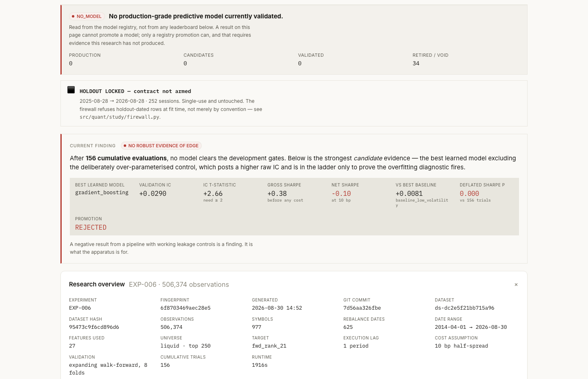

`NO_MODEL` is read from the model registry, not from the leaderboard below it, so
nothing measured on the page can change it. Regime rows carry their date counts.
Every ablation contrast reads `NO IMPROVEMENT`. The void study stays listed.

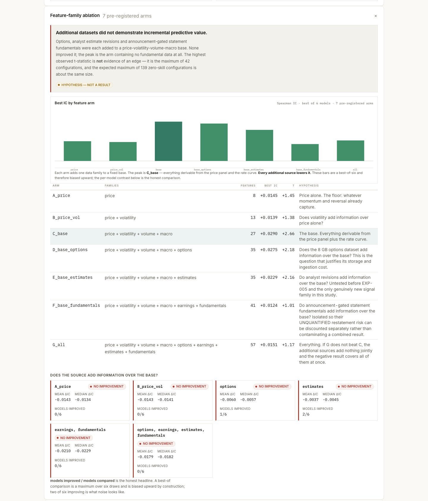

Screenshots are **LOCAL** and unverified in production — see
[`docs/screenshots/quant/README.md`](docs/screenshots/quant/README.md).

Full detail: [`docs/quant.md`](docs/quant.md) ·
[`docs/training.md`](docs/training.md) ·
[`docs/EXP-005.md`](docs/EXP-005.md) ·
[`docs/RESEARCH_LEDGER.md`](docs/RESEARCH_LEDGER.md)

### Local datasets

Four Dolt clones, ~14 GB, **never committed**. Point the app at them with:

```bash
export QUANT_DATA_ROOT=/path/to/datasets   # defaults to ./datasets
```

| Repo | Tables | Rows |
|---|---|---|
| `stocks` | ohlcv, dividend, split, symbol | 28.9M bars, 21,512 symbols, 2011→ |
| `options` | option_chain, volatility_history | **116.5M** chain rows, 2,317 symbols, 2019→ |
| `earnings` | calendar, eps/sales estimate, statements | 7.06M estimate vintages ×2, 2017→ |
| `rates` | us_treasury | 9,158 curve observations, 1990→ |

---

## Security

Credentials are backend-only with one deliberate exception: Logo.dev's
**publishable** key (`pk_`) appears in browser-facing image URLs, which is what
Logo.dev documents it for. The **secret** key (`sk_`) is read only server-side
and never enters a response, a URL, a log or a bundle.

The vulnerability this hardening exists for was real: several vendors
authenticate by query string, so `requests` embedded the key in every
`HTTPError` message, which travelled into `Evidence.error` and out through the
provenance payload. **A single 403 was enough to publish an API key to the
browser.**

Redaction now happens where the error is constructed. A regression suite drives
four fake secrets through five URL shapes plus an end-to-end path — exploding
vendor → `Evidence` → ledger → JSON — and also asserts the error stays
*readable*, since an unreadable error is not safer.

## Failure semantics

| Status | Meaning | Behaviour |
|---|---|---|
| `not_configured` | No credential in this environment | Vendor skipped, absence recorded |
| `not_entitled` | Vendor answered; plan does not cover it | Recorded as a permission boundary, not an outage — the circuit breaker is not tripped |
| `rate_limited` | 429 or local token bucket empty | Recorded; no retry storm |
| `timeout` | Exceeded the adapter or fan-out deadline | Recorded with elapsed time |
| `unavailable` | Answered with nothing usable | Distinct from "no data exists" |

One provider failing never fails a request. Four of seven answering is a valid
research result, and the three that did not are visible in the ledger.

## Design decisions

Twenty-four decisions are recorded in **[docs/design-decisions.md](docs/design-decisions.md)**,
each stating the problem, the decision, the alternative rejected and the
reason. The ones that came from a measured failure rather than a preference:

| Decision | What forced it |
|---|---|
| Group XBRL facts by full period, not period end | Grouping by end date compared FY revenue against Q4 revenue filed the same day — **106 false restatements** for AAPL, reduced to 9 genuine ones |
| Reconcile the profile *before* building a visual query | The single-vendor chain returned Apple's industry as `Technology`; the union resolves `Consumer Electronics`, and a query is only as specific as the label behind it |
| Measure series agreement against the median of **all** vendors | Excluding the vendor under test put the reference between a correct pair, making both correct vendors read as wrong |
| Count session gaps only inside the shared window | Twelve Data returned 92 sessions where Polygon returned 63 for the same request; differencing against the union reported Polygon as "missing 29" |
| Hide the article thumbnail until it decodes | Six empty grey boxes in a production screenshot of an otherwise clean headline column |
| Redact credentials where the error is built | A vendor URL carrying a key in its query string reaches exception text, provenance and API responses through paths no log filter covers |

## Documentation

- [`docs/architecture.md`](docs/architecture.md) — system context, evidence
  lifecycle, domain model, CRC responsibilities
- [`docs/data-flow.md`](docs/data-flow.md) — sequence diagrams for research,
  failure, SEC/XBRL, portfolio and visual pipelines
- [`docs/verification.md`](docs/verification.md) — what is live-verified versus
  fixture-only, per provider
- [`docs/SCORING.md`](docs/SCORING.md) — the quantitative framework
- [`docs/PANEL.md`](docs/PANEL.md) — the point-in-time factor panel
- [`docs/ml-architecture.md`](docs/ml-architecture.md) — the machine-learning
  layer: pipeline, leakage control, CRC cards
- [`docs/dataset-catalog.md`](docs/dataset-catalog.md) — every research dataset,
  measured; what was rejected and why
- [`docs/research-data.md`](docs/research-data.md) — ingestion, immutable
  storage, the survivorship-free universe
- [`docs/modeling-methodology.md`](docs/modeling-methodology.md) — features,
  labels, models, validation, defences against data mining
- [`docs/backtesting.md`](docs/backtesting.md) — transaction costs, factor
  attribution, significance
- [`docs/model-registry.md`](docs/model-registry.md) — gated promotion
- [`docs/PRE_HOLDOUT_AUDIT.md`](docs/PRE_HOLDOUT_AUDIT.md) — the audit that
  invalidated the study, what it found and what was fixed
- [`docs/HOLDOUT_CONTRACT.md`](docs/HOLDOUT_CONTRACT.md) — the pre-registration
  the holdout runner enforces
- [`docs/RESEARCH_LEDGER.md`](docs/RESEARCH_LEDGER.md) — every experiment and its
  cumulative multiple-testing exposure
- [`docs/feature_audit.json`](docs/feature_audit.json) — per-feature provenance,
  lookback, availability lag, fit scope and leakage test
- [`docs/research-report.md`](docs/research-report.md) — the findings, including
  the negative ones (generated from the study artifact, not transcribed).
  **Superseded by the audit: its learned-model results are void**
- [`docs/quant-leakage-prevention.md`](docs/quant-leakage-prevention.md) — every
  leak, its mechanism, and the test that would fail without it
- [`docs/quant-experiments.md`](docs/quant-experiments.md) — the experiment
  ledger and why hyperparameters were not tuned
- [`docs/quant/data-model.md`](docs/quant/data-model.md) — sources, keys, joins,
  temporal semantics per field
- [`docs/quant/validation.md`](docs/quant/validation.md) — walk-forward geometry
  and what a result has to clear
- [`docs/quant/model-card.md`](docs/quant/model-card.md) — intended use,
  limitations, what must not be claimed
- [`docs/quant/deployment.md`](docs/quant/deployment.md) — the inference
  contract, and the gates nothing has passed

---

## Environment variables

**Render (backend)**

| Var | Required | Purpose |
|---|---|---|
| `FRED_API_KEY` | yes | Macro series (free: fred.stlouisfed.org) |
| `ALPHA_VANTAGE_KEY` | optional | Fundamentals (free tier: 25 req/day) |
| `NEWSAPI_KEY` | optional | Premium headlines (falls back to Yahoo RSS) |
| `GROQ_API_KEY` | optional | LLM narration (free tier: console.groq.com) |
| `LLM_MODEL` | optional | Default `openai/gpt-oss-120b` |
| `POLYGON_API_KEY` · `FINNHUB_API_KEY` · `TWELVEDATA_API_KEY` · `FMP_API_KEY` · `MARKETSTACK_API_KEY` · `GNEWS_API_KEY` · `TAVILY_API_KEY` · `EXA_API_KEY` | optional | Extra vendors in the provider chains — each self-disables when absent |
| `SUPABASE_URL` | optional | Persistence: hosted Supabase project URL |
| `SUPABASE_SERVICE_ROLE_KEY` | optional | Persistence: server-only key (bypasses RLS by design — never ships to a browser) |
| `CLERK_JWKS_URL` | optional | Verify Clerk session JWTs (`https://<instance>.clerk.accounts.dev/.well-known/jwks.json`) |
| `CLERK_ISSUER` | optional | Expected `iss` claim (`https://<instance>.clerk.accounts.dev`) |
| `ALLOWED_ORIGINS` | optional | CORS allowlist, comma-separated |
| `LOG_LEVEL` | optional | Default `INFO` |

All four persistence vars are optional as a group: without them the API runs
with persistence disabled and analysis fully functional.

**Vercel (frontend)**

| Var | Required | Purpose |
|---|---|---|
| `NEXT_PUBLIC_CLERK_PUBLISHABLE_KEY` / `CLERK_SECRET_KEY` | yes | Auth |
| `NEXT_PUBLIC_RAZORPAY_KEY_ID` | yes | Razorpay Checkout in the browser (key IDs are public by design — this one is *intentionally* exposed) |
| `RAZORPAY_KEY_ID` | yes | Server-only copy of the key ID for order creation — API routes never read `NEXT_PUBLIC_*` values |
| `RAZORPAY_KEY_SECRET` | yes | Order creation + HMAC verification — must **never** be exposed to the browser |
| `BACKEND_ORIGIN` | optional | Backend base for the `/api/*` proxy (defaults to the Render deployment) |
| `NEXT_PUBLIC_SITE_URL` | optional | Canonical URL for metadata |

Keys live **only** in hosting dashboards and local `.env` files (gitignored).
CI runs gitleaks on full history; `pre-commit install` adds the same scan locally.

## Development

```bash
# Backend
pip install -r requirements-dev.txt
cp .env.example .env            # add your FRED key
uvicorn api.index:app --reload --port 8000
python -m pytest tests/ -v      # hermetic by default

# Frontend
cd dashboard
npm install
echo 'BACKEND_ORIGIN=http://127.0.0.1:8000' >> .env.local   # else it uses the live Render API
npm run dev                     # http://localhost:3000
npm test && npm run lint && npx tsc --noEmit && npm run build
```

Opt-in live smoke tests: `OMNISIGNAL_LIVE_TESTS=1 python -m pytest tests/test_live_smoke.py`.

## Project structure

```
├── api/index.py          FastAPI app (thin HTTP layer; sync handlers on purpose)
├── src/
│   ├── scoring/engine.py Scoring engine v2.1 — factors, sleeves, gate, verdict
│   ├── models.py         Pydantic domain models
│   ├── decision.py       Shared verdict/confidence/risk synthesis
│   ├── risk_analysis.py  FRED → Systemic Risk Multiplier
│   ├── sentiment_edge.py Multi-source headline sentiment
│   ├── panel/            Point-in-time factor panel (immutable snapshots)
│   ├── research/         Cross-sectional factor evaluation
│   ├── quant/            Research + ML layer (see docs/ml-architecture.md)
│   │   ├── datasets/     Local Dolt + HTTP + French ingestion, RawStore, catalog
│   │   ├── pit/          PIT returns, survivorship-free universe, leakage guards
│   │   ├── features/     Registry; price · macro · options · earnings · cross-sectional
│   │   ├── labels/       Forward returns, volatility, excursion, rank
│   │   ├── models/       Baselines, linear, trees, gated registry
│   │   ├── validation/   Walk-forward, metrics, significance
│   │   ├── backtest/     Cost model, engine, factor attribution
│   │   └── regime/       Rule-based + unsupervised regime labelling
│   ├── providers/        Vendor-agnostic data facades + fallback chains
│   └── services/         Backtest, dashboard, screen, memo, news scoring,
│       │                 LLM narration, in-process metrics
│       ├── clerk_auth.py Clerk session-JWT verification (JWKS, cached)
│       └── database/     Supabase client factory + repositories
│           └── repositories/  profiles · watchlists · analysis (+saved
│                              reports + comparison) · portfolio · preferences
├── api/persistence.py    Persistence REST router (Clerk-scoped CRUD)
├── dashboard/            Next.js 16 app (see dashboard/README.md)
├── supabase/migrations/  CLI-managed schema (see Migration workflow)
├── scripts/quant/        backfill.py (HTTP) · local_backfill.py (clones)
│                         study.py (the tournament) · report.py (the findings)
├── datasets/             Dolt clones — 14 GB, gitignored, see docs/research-data.md
├── tests/                Pytest suite + opt-in live smoke tests
│   └── quant/            Leakage, dataset, model, backtest, validation, pipeline
├── docs/                 Scoring framework, audits, design system, QA log
└── research_vault/       Generated reports (gitignored; one example kept)
```

## API

| Endpoint | Description |
|---|---|
| `GET /api/health` | Service + data-source status |
| `GET /api/macro` | SRM + FRED indicators |
| `GET /api/research/{ticker}` | Full pipeline; `?fast=true` skips sentiment + LLM |
| `GET /api/chart/{ticker}?period=` | Daily close/volume series |
| `GET /api/dashboard` | Market intelligence: FRED macro board, breadth, 11 sectors, event calendar (15-min cache) |
| `GET /api/quotes?symbols=` | Batch watchlist quotes (≤25; per-symbol failure isolation) |
| `GET /api/screen?q=` | Ticker/company/theme search — thematic queries are web-grounded and symbol-validated |
| `GET /api/memo/{ticker}` | Evidence-cited investment memo on top of research |
| `GET /api/backtest/{ticker}` | Walk-forward validation (see Validation above) |
| `GET /api/providers/health` | Vendor success %, latency, cooldowns, cache + dedupe stats |
| `GET /api/ml/capabilities` | What the ML layer can answer, with a reason and a remediation when it cannot |
| `GET /api/ml/datasets` | Research dataset catalog, including sources deliberately excluded and why |
| `GET /api/ml/features` | Every feature and label definition with lookback, availability lag, PIT status |
| `GET /api/ml/overview` | Study headline: dataset, universe, regime, per-label verdicts |
| `GET /api/ml/labels/{label}` | Every model evaluated against one label — losers included |
| `GET /api/ml/registry` | Registered models, status, and the evidence each still lacks |
| `GET /api/ml/provenance/{label}/{model}` | Vendor observation → model output, stage by stage |
| `GET/POST/PATCH/DELETE /api/watchlists…` | Cloud watchlists + items (Clerk-authenticated) |
| `GET/POST/PATCH/DELETE /api/portfolio…` | Portfolio positions |
| `GET /api/portfolio/intelligence` | Book valuation, historical value curve, concentration, sector exposure, risk concentration |
| `GET/DELETE /api/history…` | Paginated analysis history with ticker/verdict/date/search filters |
| `GET /api/history/compare?a=&b=` | Deterministic factor-level comparison of two stored runs |
| `GET/POST/PATCH/DELETE /api/saved-reports…` | Bookmarked reports with notes |
| `GET/PATCH /api/preferences` · `POST /api/profile/sync` | Preferences + profile |

Terminal pages: `/terminal` (market dashboard), `/terminal/analyze`,
`/terminal/portfolio` (cloud watchlists + positions), `/terminal/vault`
(research history, saved reports, run comparison), `/terminal/factors`
(cross-sectional factor evidence), `/terminal/models` (model intelligence),
`/terminal/validation`, `/terminal/methodology`.

The `/api/ml/*` endpoints are **read-only over offline artifacts**. They never
train, backtest or ingest: a page load must not be able to start a walk-forward,
for the same reason `backtest_service.peek_cached` exists. When no study has
been run they report `unavailable` with the command that would produce one,
rather than computing a cheap approximation — a placeholder rendered where a
walk-forward result belongs cannot be told apart from the real thing.

Contract note: `verdict`, `macro`, `technicals`, `sentiment` are stable;
`confidence`, `confidence_breakdown`, `risk_level`, `rationale`, `ai`,
`disclaimer` were added additively in v1.1; `technical_intelligence` and
`street_intelligence` in v4.5; `provenance` in v5. Every addition is additive —
a client that ignores the new keys behaves exactly as before.

### LLM narration layer

`src/services/llm_service.py` calls Groq `openai/gpt-oss-120b` with
deterministic parameters (`temperature=0.2, top_p=1, reasoning_effort=medium,
max 4096 tokens, JSON-object mode`). The model receives the engine's finished
scorecard — recommendation, itemized confidence, risk decomposition, factor
contributions, macro, sentiment — and returns narrative fields only. Output is
`json.loads`-parsed and Pydantic-validated (one corrective retry, then a
deterministic fallback assembled from the engine's own rationale — never a
failed request). The schema has no decision fields, so the model *cannot*
alter recommendation/confidence/risk; engine values are attached verbatim.
Responses cache 5 minutes per (ticker, day, verdict, model, prompt version).

## License

MIT — see LICENSE. Research and education only; not investment advice.
