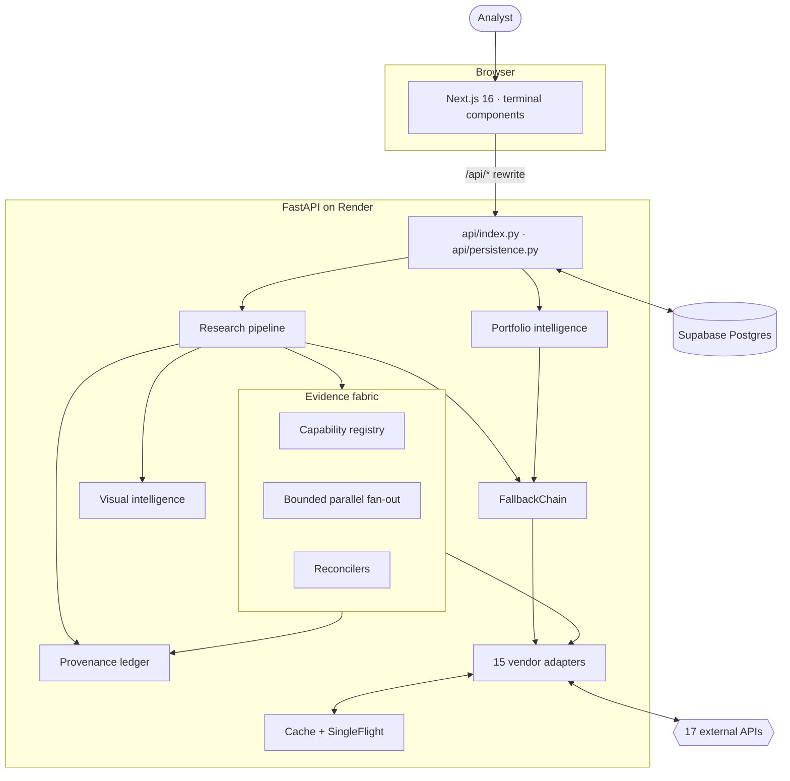
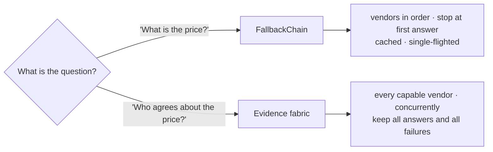
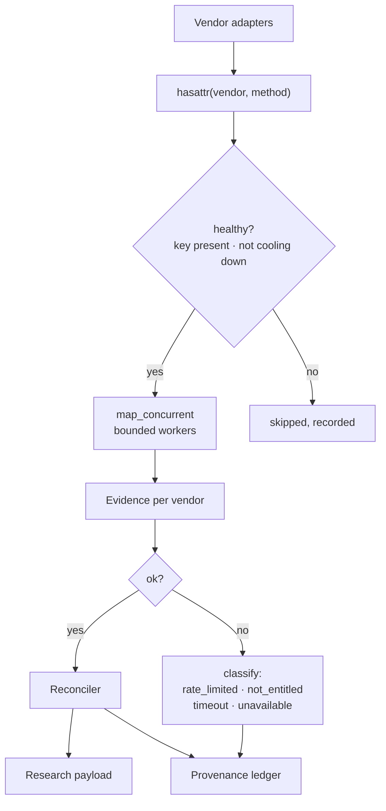
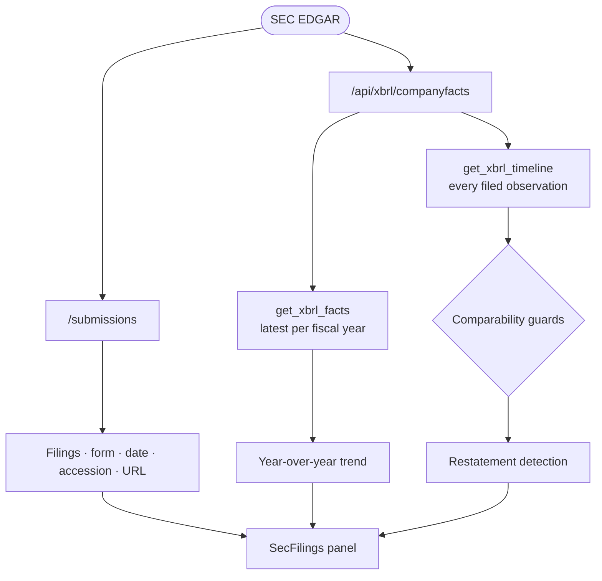
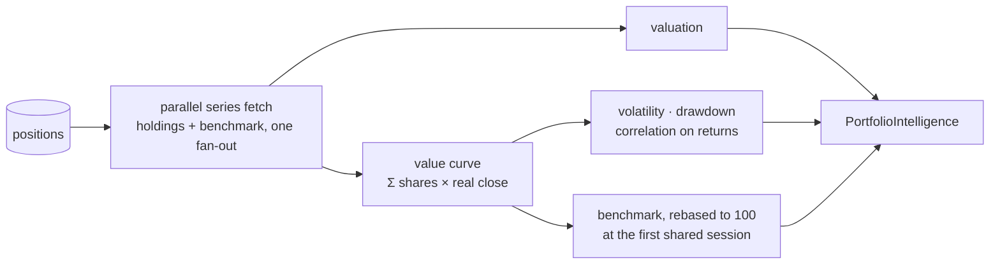
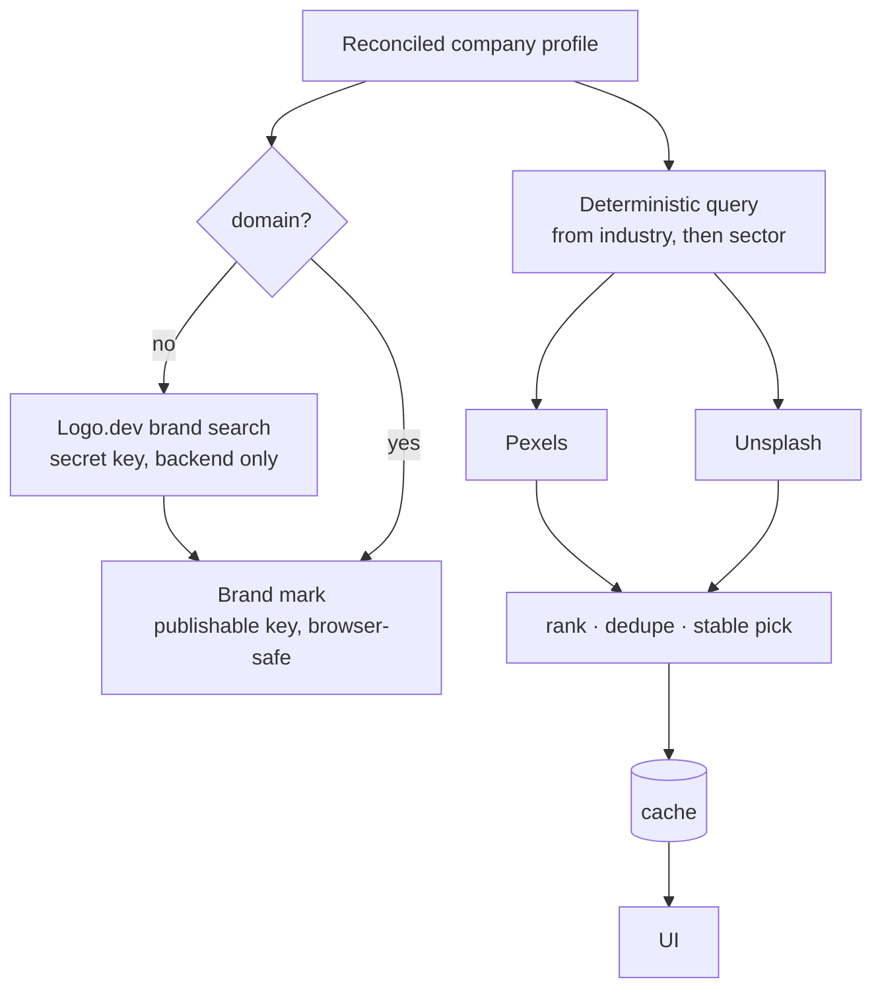

# OmniSignal

An evidence-driven equity research terminal. Seventeen data providers are
queried **concurrently**, their answers are **reconciled rather than
overwritten**, their disagreements and failures are **preserved as evidence**,
and every number on screen can be traced back to the vendor and the moment it
came from.

**Live:** [mini-aladding.vercel.app](https://mini-aladding.vercel.app)

---

## The problem this is built around

Every financial API returns a number. None of them tells you how much to trust
it.

A single-vendor dashboard shows you `AAPL 309.35` and stops. It cannot tell you
that four other vendors also knew the price and agreed to within three cents,
or that a fifth was rate-limited, or that the figure came from yesterday's
close rather than a live print. Those are different claims, and a system that
renders them identically is asking to be believed on faith.

The design premise here is that **the evidence is the product**:

| A dashboard answers | This answers |
|---|---|
| What is the price? | Who says so, how many agree, how far apart are they, who failed to answer, and how stale is the freshest one? |
| What is revenue? | Which vendor, for which fiscal period, under which definition — and does the 10-K it was extracted from still say that? |
| What is the sentiment? | Which vendor scored it, on what scale, over how many articles, and did anyone independently corroborate the story? |

## Design principles

**Evidence over values.** A provider response becomes an `Evidence` object
carrying the vendor, capability, latency, timestamp and outcome. Reconcilers
consume evidence; the UI renders both the reconciled value and the readings
behind it.

**Failure is evidence.** A vendor that times out, hits a rate limit or answers
403 produces an `Evidence` object exactly like one that succeeds. Dropping
those makes a degraded run indistinguishable from a narrow one.

**Reconcile only what is comparable.** Five contemporaneous quotes of one
instrument are five measurements of one quantity, so a median is meaningful.
Two vendors' revenue figures usually differ because they cover different fiscal
periods or definitions — averaging them produces a number no company ever
filed. Prices get consensus; fundamentals get a union with the conflict shown.

**Missing is not zero.** An absent quality factor and a quality factor that
scored neutral look identical in a decomposition. Only one of them means "we
did not know", so absence is carried explicitly.

**Normalise at the boundary.** Yahoo reports margins as fractions and
debt/equity as a percentage; Finnhub does the opposite of each. Both are
converted in the adapter, so a reconciler compares like with like — left alone,
two vendors that agree exactly would render as a 100× conflict.

**Period semantics are load-bearing.** A trailing margin and a five-year
average are different measurements and get different field names. A fiscal-year
figure is never compared against the fourth quarter that shares its end date.

## Architecture



No queue, no broker, no worker, no container orchestration. Vercel serves the
frontend; `next.config.ts` rewrites `/api/*` to the Render backend.

## Two retrieval modes, and why both exist

This is the central architectural decision, and the reason an audit that sees
`FallbackChain` and assumes it is dead code would be reading it wrong.



The chain serves the scoring engine, the batch quotes endpoint and the
portfolio series loader — callers that want *a price, now*. A six-vendor
fan-out on a watchlist refresh would cost six times as much for a caller that
wants one number.

The fabric serves research and provenance, where the interesting output is the
agreement rather than the value. Both use the same vendor objects, rate
limiters and cache, so a fan-out following a chain for the same symbol is
largely free.

## Evidence fabric

Capabilities are discovered by **method introspection**, not a hand-maintained
table — a table drifts the first time someone adds a method and forgets to
register it.



Fan-out latency is the slowest vendor, not the sum. Measured locally:

| Fan-out | Vendors | Wall time | Answered |
|---|---|---|---|
| Quote | 7 | 3.13 s | 4 |
| Company profile | 6 | 1.25 s | 3 |
| News | 6 | 2.45 s | 2 |
| SEC filings | 1 | 4.18 s | 1 |
| Ownership | 1 | 0.86 s | 1 |

## Reconciliation

| Data | Strategy | Why |
|---|---|---|
| Price | Median + range + dispersion + agreement count | Contemporaneous measurements of one quantity. Median resists one vendor serving a stale previous close. |
| Session fields (OHLC, VWAP, MAs) | Attributed to the supplying vendor, never medianed | A session high is a fact about one venue's tape; a moving average carries that vendor's adjustment conventions. |
| Company profile | Union, longest-value tie-break, numeric conflicts flagged | No vendor carries a complete profile. GICS beats SIC — an all-caps `ELECTRONIC COMPUTERS` loses to `Consumer Electronics`. |
| Fundamentals / statements | Union, both readings kept, conflicts surfaced | Different vendors report different periods and definitions. |
| Analyst targets | Side by side per vendor, never merged | Each vendor polls a different analyst set; a median across them is a consensus of no actual group. |
| Ownership | Single vendor, settlement date attached | Exchanges publish short interest twice monthly; the date is not optional. |
| News | Dedupe by URL then canonical title; corroboration counted | Syndication changes the URL and keeps the copy. |
| SEC / XBRL | Primary source, never merged into the vendor union | The filing is the document the vendors are describing, not a fourth opinion. |

## Primary-source intelligence: SEC filings and XBRL

SEC EDGAR is keyless, which makes it the only fundamentals-adjacent source
that answers in every environment including CI. It is deliberately **not** a
fourth fundamentals vendor: when a vendor's revenue disagrees with the 10-K,
the 10-K is not a fourth opinion to median against.



### The restatement bug worth documenting

The first implementation grouped observations by period **end** and reported
**106 restatements for Apple**, the largest a −77% swing. Inspecting the output
rather than trusting it showed both values were filed *on the same day*: a 10-K
carries the fiscal-year figure **and** the fourth quarter that shares its end
date, so annual revenue was being compared against quarterly revenue.

Fixing it required plumbing the period **start** through the SEC adapter. That
took 106 false positives down to **9 real ones** — Apple's 2009 retrospective
adoption of ASU 2009-13, which genuinely restated FY2008/09 net income upward
and was refiled a year later.

Six guards now hold that line, each with a test: full period not end-alone,
matching units, same form family, instant vs flow never mixed, repeated values
are confirmation not change, and a 0.5% noise floor.

## Portfolio intelligence



Three constraints the maths enforces:

- **A missing price is never the buy price.** Substituting cost reports a
  holding as exactly break-even — a specific claim, and a false one. Unpriced
  holdings are excluded from totals and counted.
- **No covariance is estimated**, so nothing is labelled portfolio volatility.
  What is computed is a weighted mean of per-name risk scores, and the output
  says so beside the number.
- **The benchmark comparison is a return difference, not alpha.** No beta is
  estimated and no risk-free rate is subtracted.

Correlation is computed on **returns**, never price levels — two stocks that
both drift upward correlate at ~0.99 on levels regardless of whether their
daily moves are related, which is the classic way to make a concentrated book
look diversified.

## Visual intelligence

Two different kinds of image, never conflated:



**Logo.dev is identity. Pexels and Unsplash are context.** A stock photograph
is never presented as a company's own image, and the two image providers run
concurrently — neither is the other's fallback.

The company **name is deliberately excluded** from the image query. Searching a
stock library for a brand name returns either nothing or someone else's
photograph of that brand's products.

> **Engineering note — why reconciliation must precede enrichment.** The media
> endpoint originally built its query from `get_company()`, the *chain*, which
> returns whichever vendor answered first. Measured against production, that
> gave Apple `industry="Technology"` (Finnhub's own taxonomy) and produced
> generic imagery. The *union* resolves `"Consumer Electronics"` through the
> GICS-over-SIC rule. Same cost, materially better query — the fix was to read
> the reconciled profile instead of the first answer.

## Security

Credentials are backend-only with one deliberate exception: Logo.dev's
**publishable** key (`pk_`) appears in browser-facing image URLs, which is what
Logo.dev documents it for. The **secret** key (`sk_`) is read only server-side
and never enters a response, a URL, a log or a bundle.

The vulnerability this hardening exists for was real: several vendors
authenticate by query string, so `requests` embedded the key in every
`HTTPError` message, which travelled into `Evidence.error` and out through the
provenance payload. **A single 403 was enough to publish an API key to the
browser.**

Redaction now happens where the error is constructed. A regression suite drives
four fake secrets through five URL shapes plus an end-to-end path — exploding
vendor → `Evidence` → ledger → JSON — and also asserts the error stays
*readable*, since an unreadable error is not safer.

## Failure semantics

| Status | Meaning | Behaviour |
|---|---|---|
| `not_configured` | No credential in this environment | Vendor skipped, absence recorded |
| `not_entitled` | Vendor answered; plan does not cover it | Recorded as a permission boundary, not an outage — the circuit breaker is not tripped |
| `rate_limited` | 429 or local token bucket empty | Recorded; no retry storm |
| `timeout` | Exceeded the adapter or fan-out deadline | Recorded with elapsed time |
| `unavailable` | Answered with nothing usable | Distinct from "no data exists" |

One provider failing never fails a request. Four of seven answering is a valid
research result, and the three that did not are visible in the ledger.

## Design decisions

Each of these was a fork with a cheaper option on the other side. The cheaper
option is named so the trade is legible.

| # | Decision | Rejected alternative | Why |
|---|---|---|---|
| 1 | Fan out to every capable vendor concurrently | Primary provider with fallbacks | A fallback chain throws away every answer after the first. Agreement between vendors is the only evidence of correctness the system can obtain, and a chain destroys it by construction. |
| 2 | Keep `FallbackChain` *alongside* the fabric | Delete it once the fabric existed | They answer different questions. The chain serves one value fast for a single field; the fabric builds evidence from all of them. Deleting the chain would have made every cheap lookup pay fan-out cost. |
| 3 | Discover capabilities by method introspection | A hand-maintained registry | A registry drifts silently the moment an adapter gains a method. `hasattr` against `CAPABILITY_METHODS` cannot drift — the capability *is* the method. |
| 4 | Reconcile prices by median | Mean | One vendor quoting a stale or wrong tape moves a mean and cannot move a median past the other four. |
| 5 | Reconcile profile and fundamentals by union | Highest-priority vendor wins | Vendors have non-overlapping coverage. A union takes the field from whoever has it; a priority rule discards a real value because a higher-ranked vendor returned `null`. |
| 6 | Attribute session fields per vendor, never merge | One unattributed row | A session high belongs to one venue's tape and a 50-day average uses that vendor's adjustment conventions. Merging them would assert a consensus that was never computed. |
| 7 | Classify failures instead of dropping them | Catch and continue | `rate_limited`, `not_entitled`, `timeout` and `not_configured` demand four different responses from a reader. Collapsing them into "no data" throws away the only actionable part. |
| 8 | Group XBRL facts by full period, not period end | Group by `period_end` | Grouping by end date compared FY revenue against Q4 revenue filed the same day and produced **106 false restatements** for AAPL. Plumbing `period_start` through reduced it to 9 — all genuine ASU 2009-13 adjustments. |
| 9 | Store point-in-time facts, not collapsed ones | Latest value per concept | A restatement is only visible if both the original and the revision survive. Collapsing erases exactly the thing worth detecting. |
| 10 | Reconcile the profile *before* building a visual query | Use `get_company`'s single winner | The chain returned Apple's industry as `Technology`; the union resolves `Consumer Electronics` via the GICS-over-SIC rule. A query is only as specific as the label it is built from — the coarse one produced generic imagery at identical cost. |
| 11 | Separate brand identity from context imagery | One "image" concept | Logo.dev returns *what the company is*; Pexels and Unsplash return *what the subject looks like*. Presenting a stock photograph as a company's mark, or as an article's own picture, is a small repeated lie. |
| 12 | Redact credentials at error-construction time | Sanitise at the logging boundary | A vendor URL carrying a key in its query string reaches exception text, provenance and API responses through paths no log filter covers. Redacting where the error is built covers all of them at once. |
| 13 | Publishable Logo.dev key in the browser, secret server-only | One key for both | The `pk_` token is documented as browser-safe and is required for `` URLs. The `sk_` token authenticates lookup APIs and never enters a `NEXT_PUBLIC_*` variable or a client bundle. |
| 14 | Call it a "return difference", not alpha | Label it alpha | Alpha requires a beta estimate against the benchmark. No covariance model exists here, so the honest name for the quantity actually computed is the difference of two returns. |
| 15 | Normalise units at the adapter boundary | Normalise at render | One vendor's `0.2287` and another's `22.87` are the same margin. Fixing it at the edge means every downstream consumer — reconciliation, ratios, UI — sees one convention instead of each guessing. |
| 16 | Dedupe news on URL *and* canonical title | URL only | Syndicated wire copy appears under many URLs. URL-only dedupe reports the same story five times and inflates the corroboration count that is supposed to measure independence. |

## Documentation

- [`docs/architecture.md`](docs/architecture.md) — system context, evidence
  lifecycle, domain model, CRC responsibilities
- [`docs/data-flow.md`](docs/data-flow.md) — sequence diagrams for research,
  failure, SEC/XBRL, portfolio and visual pipelines
- [`docs/verification.md`](docs/verification.md) — what is live-verified versus
  fixture-only, per provider
- [`docs/SCORING.md`](docs/SCORING.md) — the quantitative framework

---

## Environment variables

**Render (backend)**

| Var | Required | Purpose |
|---|---|---|
| `FRED_API_KEY` | yes | Macro series (free: fred.stlouisfed.org) |
| `ALPHA_VANTAGE_KEY` | optional | Fundamentals (free tier: 25 req/day) |
| `NEWSAPI_KEY` | optional | Premium headlines (falls back to Yahoo RSS) |
| `GROQ_API_KEY` | optional | LLM narration (free tier: console.groq.com) |
| `LLM_MODEL` | optional | Default `openai/gpt-oss-120b` |
| `POLYGON_API_KEY` · `FINNHUB_API_KEY` · `TWELVEDATA_API_KEY` · `FMP_API_KEY` · `MARKETSTACK_API_KEY` · `GNEWS_API_KEY` · `TAVILY_API_KEY` · `EXA_API_KEY` | optional | Extra vendors in the provider chains — each self-disables when absent |
| `SUPABASE_URL` | optional | Persistence: hosted Supabase project URL |
| `SUPABASE_SERVICE_ROLE_KEY` | optional | Persistence: server-only key (bypasses RLS by design — never ships to a browser) |
| `CLERK_JWKS_URL` | optional | Verify Clerk session JWTs (`https://<instance>.clerk.accounts.dev/.well-known/jwks.json`) |
| `CLERK_ISSUER` | optional | Expected `iss` claim (`https://<instance>.clerk.accounts.dev`) |
| `ALLOWED_ORIGINS` | optional | CORS allowlist, comma-separated |
| `LOG_LEVEL` | optional | Default `INFO` |

All four persistence vars are optional as a group: without them the API runs
with persistence disabled and analysis fully functional.

**Vercel (frontend)**

| Var | Required | Purpose |
|---|---|---|
| `NEXT_PUBLIC_CLERK_PUBLISHABLE_KEY` / `CLERK_SECRET_KEY` | yes | Auth |
| `NEXT_PUBLIC_RAZORPAY_KEY_ID` | yes | Razorpay Checkout in the browser (key IDs are public by design — this one is *intentionally* exposed) |
| `RAZORPAY_KEY_ID` | yes | Server-only copy of the key ID for order creation — API routes never read `NEXT_PUBLIC_*` values |
| `RAZORPAY_KEY_SECRET` | yes | Order creation + HMAC verification — must **never** be exposed to the browser |
| `BACKEND_ORIGIN` | optional | Backend base for the `/api/*` proxy (defaults to the Render deployment) |
| `NEXT_PUBLIC_SITE_URL` | optional | Canonical URL for metadata |

Keys live **only** in hosting dashboards and local `.env` files (gitignored).
CI runs gitleaks on full history; `pre-commit install` adds the same scan locally.

## Development

```bash
# Backend
pip install -r requirements-dev.txt
cp .env.example .env            # add your FRED key
uvicorn api.index:app --reload --port 8000
python -m pytest tests/ -v      # hermetic by default

# Frontend
cd dashboard
npm install
echo 'BACKEND_ORIGIN=http://127.0.0.1:8000' >> .env.local   # else it uses the live Render API
npm run dev                     # http://localhost:3000
npm test && npm run lint && npx tsc --noEmit && npm run build
```

Opt-in live smoke tests: `OMNISIGNAL_LIVE_TESTS=1 python -m pytest tests/test_live_smoke.py`.

## Project structure

```
├── api/index.py          FastAPI app (thin HTTP layer; sync handlers on purpose)
├── src/
│   ├── scoring/engine.py Scoring engine v2.1 — factors, sleeves, gate, verdict
│   ├── models.py         Pydantic domain models
│   ├── decision.py       Shared verdict/confidence/risk synthesis
│   ├── risk_analysis.py  FRED → Systemic Risk Multiplier
│   ├── sentiment_edge.py Multi-source headline sentiment
│   ├── providers/        Vendor-agnostic data facades + fallback chains
│   └── services/         Backtest, dashboard, screen, memo, news scoring,
│       │                 LLM narration, in-process metrics
│       ├── clerk_auth.py Clerk session-JWT verification (JWKS, cached)
│       └── database/     Supabase client factory + repositories
│           └── repositories/  profiles · watchlists · analysis (+saved
│                              reports + comparison) · portfolio · preferences
├── api/persistence.py    Persistence REST router (Clerk-scoped CRUD)
├── dashboard/            Next.js 16 app (see dashboard/README.md)
├── supabase/migrations/  CLI-managed schema (see Migration workflow)
├── tests/                Pytest suite (215 tests) + opt-in live smoke tests
├── docs/                 Scoring framework, audits, design system, QA log
└── research_vault/       Generated reports (gitignored; one example kept)
```

## API

| Endpoint | Description |
|---|---|
| `GET /api/health` | Service + data-source status |
| `GET /api/macro` | SRM + FRED indicators |
| `GET /api/research/{ticker}` | Full pipeline; `?fast=true` skips sentiment + LLM |
| `GET /api/chart/{ticker}?period=` | Daily close/volume series |
| `GET /api/dashboard` | Market intelligence: FRED macro board, breadth, 11 sectors, event calendar (15-min cache) |
| `GET /api/quotes?symbols=` | Batch watchlist quotes (≤25; per-symbol failure isolation) |
| `GET /api/screen?q=` | Ticker/company/theme search — thematic queries are web-grounded and symbol-validated |
| `GET /api/memo/{ticker}` | Evidence-cited investment memo on top of research |
| `GET /api/backtest/{ticker}` | Walk-forward validation (see Validation above) |
| `GET /api/providers/health` | Vendor success %, latency, cooldowns, cache + dedupe stats |
| `GET/POST/PATCH/DELETE /api/watchlists…` | Cloud watchlists + items (Clerk-authenticated) |
| `GET/POST/PATCH/DELETE /api/portfolio…` | Portfolio positions |
| `GET /api/portfolio/intelligence` | Book valuation, historical value curve, concentration, sector exposure, risk concentration |
| `GET/DELETE /api/history…` | Paginated analysis history with ticker/verdict/date/search filters |
| `GET /api/history/compare?a=&b=` | Deterministic factor-level comparison of two stored runs |
| `GET/POST/PATCH/DELETE /api/saved-reports…` | Bookmarked reports with notes |
| `GET/PATCH /api/preferences` · `POST /api/profile/sync` | Preferences + profile |

Terminal pages: `/terminal` (market dashboard), `/terminal/analyze`,
`/terminal/portfolio` (cloud watchlists + positions), `/terminal/vault`
(research history, saved reports, run comparison), `/terminal/validation`,
`/terminal/methodology`.

Contract note: `verdict`, `macro`, `technicals`, `sentiment` are stable;
`confidence`, `confidence_breakdown`, `risk_level`, `rationale`, `ai`,
`disclaimer` were added additively in v1.1; `technical_intelligence` and
`street_intelligence` in v4.5; `provenance` in v5. Every addition is additive —
a client that ignores the new keys behaves exactly as before.

### LLM narration layer

`src/services/llm_service.py` calls Groq `openai/gpt-oss-120b` with
deterministic parameters (`temperature=0.2, top_p=1, reasoning_effort=medium,
max 4096 tokens, JSON-object mode`). The model receives the engine's finished
scorecard — recommendation, itemized confidence, risk decomposition, factor
contributions, macro, sentiment — and returns narrative fields only. Output is
`json.loads`-parsed and Pydantic-validated (one corrective retry, then a
deterministic fallback assembled from the engine's own rationale — never a
failed request). The schema has no decision fields, so the model *cannot*
alter recommendation/confidence/risk; engine values are attached verbatim.
Responses cache 5 minutes per (ticker, day, verdict, model, prompt version).

## License

MIT — see LICENSE. Research and education only; not investment advice.
