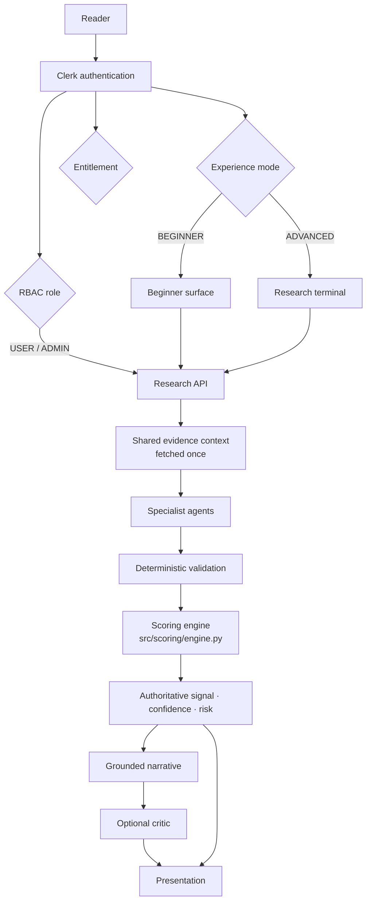

# OmniSignal — evidence-grounded multi-agent equity research

## The claim

A deterministic quantitative engine makes the financial decision. Specialist
agents gather evidence and make traceable claims about a security. A
deterministic validator checks those claims against that evidence. A language
model explains the result and is never permitted to change it.

The distinction this architecture is built around: **an LLM explains a
decision; it does not make one.** Everything below exists to keep that true
under pressure — under provider outages, under stale data, under sources that
disagree, and under third-party text written specifically to subvert it.

## Flow

The order is fixed and the direction of the arrows is the point: the decision
is produced by the scoring engine and flows *outwards* to the narrative. No
arrow returns from `N` or `C` to `D`.

## Three independent dimensions

| Dimension | Values | Decides | Stored |
|---|---|---|---|
| Role | `USER`, `ADMIN` | what you may do | `profiles.role` |
| Experience | `BEGINNER`, `ADVANCED` | how it is drawn | `user_preferences.experience_mode` |
| Entitlement | `FREE`, `PRO` | what was paid for | Clerk `publicMetadata.isPro` |

They are separate lookups and none implies another. An advanced user is not an
administrator; a subscriber is not an administrator; a beginner is not a
free-tier account. Collapsing any pair is a security bug waiting for a product
decision to trigger it.

## What is deterministic and what is generated

| Produced by the engine | Produced by a model |
|---|---|
| BUY / HOLD / SELL verdict | executive summary |
| analysis confidence (0–100) | investment thesis, bull and bear case |
| risk score and its components | factor and macro narration |
| every factor value and contribution | catalysts and things to watch |
| data completeness | plain-language beginner summary |
| Explore rankings and trend scores | — |

`llm_service._attach_deterministic` overwrites the model's `recommendation`,
`confidence`, `risk` and `factor_impacts` with the engine's after generation,
so a model that emits its own is ignored by construction rather than by
prompt discipline.

## Where each piece lives

| Concern | Module |
|---|---|
| Authorization | `src/services/authz.py` |
| Deployment identity | `src/services/deployment.py` |
| Scoring authority | `src/scoring/engine.py` |
| Explore ranking | `src/services/explore_ranking.py` |
| Explore eligibility | `src/services/explore_eligibility.py` |
| Explore snapshots | `src/services/explore_service.py` |
| Universe | `config/universe_us_v1.json`, `src/services/universe.py` |
| Agent contracts | `src/agents/schemas.py` |
| Agents | `src/agents/{market,fundamental,technical,news,macro_risk}_agent.py` |
| Validation | `src/agents/validation_agent.py` |
| Optional critic | `src/agents/critic_agent.py` |
| Narrative | `src/services/llm_service.py` |
| Evaluation | `src/evaluation/` |

## Scope

US-listed common equities. The macro gate is built from FRED, the Federal
Funds rate, US CPI, the US yield curve and SPY. Those are not global facts,
and applying them to a non-US listing would price one market's regime into
another market's securities. International support needs market adapters, not
a longer ticker list.
