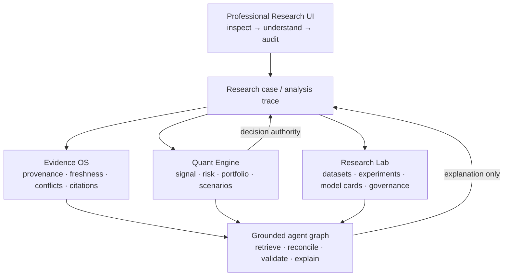

# OmniSignal architecture v2

OmniSignal is three accountable systems joined by typed contracts, not one
agent that owns the answer.



## Authority

The deterministic scoring engine is the only decision authority. Agents emit
evidence and claims; reconciliation preserves agreement, single-source support,
conflict, staleness and unavailability; validation can withhold a narrative.
Neither an agent nor an LLM can create or change a signal, confidence, risk
score, portfolio weight or promotion state.

## Point-in-time sequence

```mermaid
sequenceDiagram
    participant S as Source
    participant E as Evidence store
    participant A as LangGraph specialists
    participant R as Reconciler / validator
    participant Q as Quant engine
    participant U as Research UI
    S->>E: observation + published/available/retrieved times
    E->>A: one shared snapshot
    A->>R: typed claims + evidence handles
    R->>R: group comparable fields; preserve conflict
    E->>Q: deterministic inputs
    Q->>U: authoritative signal / risk / completeness
    R->>U: evidence state + admissible explanation
```

## Runtime truth

`GET /api/health` is process liveness. `GET /api/system/health` is research
readiness and reports component states as `READY`, `DEGRADED`, `BLOCKED`,
`UNAVAILABLE` or `NOT_CONFIGURED`. A critical research block prevents the
overall report from becoming READY even when the API process is responsive.

## Current governed state

Rich PIT v2 is `ds-richpit2-6368cccdb94c62d0` with 94 features. EXP-011 has an
unresolved revenue-mapping impact; the final holdout remains sealed and not
ready; EXP-012 has not been created. The System workspace exposes those facts
as runtime state rather than relying on this document.
