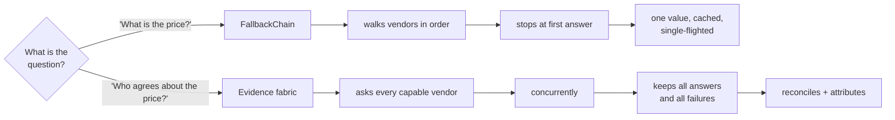
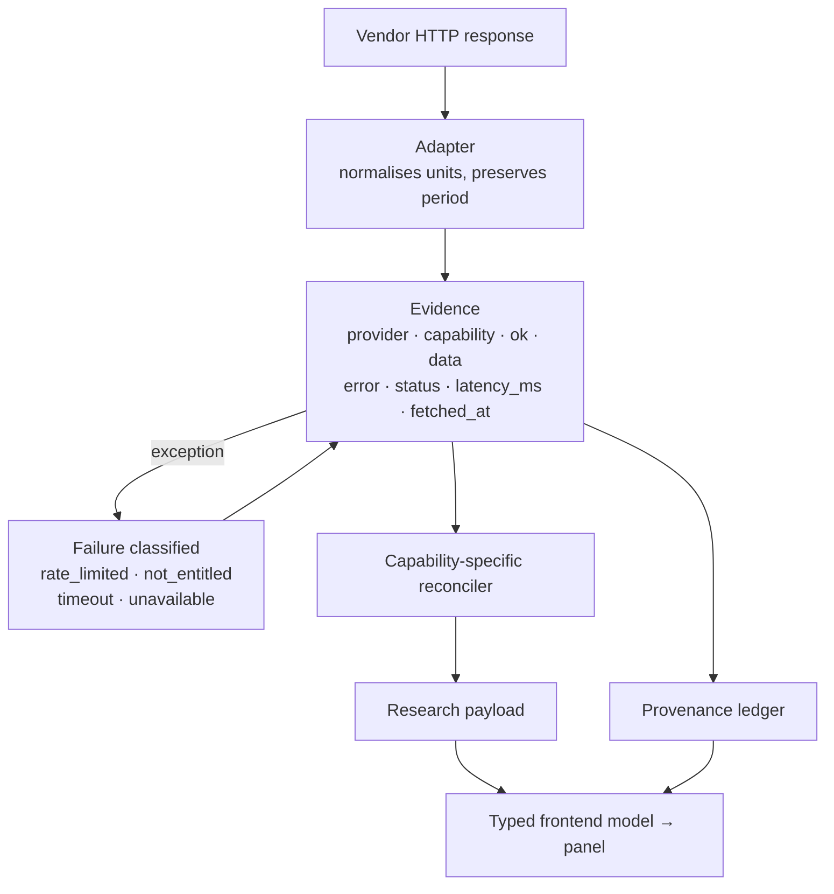
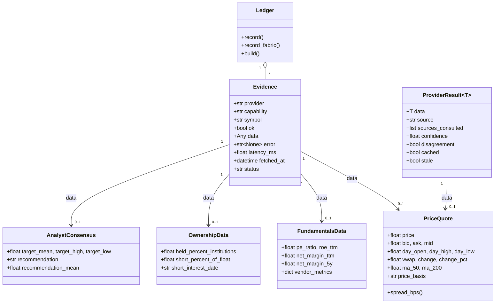

# Architecture

Derived from the code, not from intent. Every component named here maps to a
file you can open.

## System context

`next.config.ts` rewrites `/api/*` to `BACKEND_ORIGIN`. There is no serverless
Python on Vercel and no queue, broker or worker anywhere in this system.

## The two retrieval modes, and why both exist

This is the single most important thing to understand about the codebase, and
the distinction is documented in the module docstring of
`src/providers/providers.py`.

The chain backs the scoring engine, the batch quotes endpoint and the
portfolio series loader — callers that want *a price, now*. Running a
six-vendor fan-out on a watchlist refresh would multiply its cost by six for a
caller that wants one number.

The fabric backs research surfaces and the provenance ledger, where the
interesting output is the *agreement*, not the value. Both draw on the same
vendor objects, rate limiters and cache, so a fan-out following a chain for the
same symbol is largely free.

Replacing either with the other would be wrong in a specific way: chain-only
throws away the four vendors that also knew the answer; fabric-only makes every
watchlist tick six times more expensive.

## Evidence lifecycle

A failure produces an `Evidence` object exactly like a success does. That is
the whole point: "Polygon was asked and timed out" is a fact the reader needs,
and dropping it makes a degraded run indistinguishable from a narrow one.

## Domain model

`FundamentalsData` carries `net_margin_ttm` **and** `net_margin_5y` as separate
fields on purpose. A trailing margin and a five-year average are different
measurements; one field named `margin` would invite a reconciler to average
them.

## CRC

| Component | Responsibilities | Collaborators |
|---|---|---|
| `fabric.collect` | discover capable vendors by method introspection; fan out concurrently; classify failures; record latency | `parallel.map_concurrent`, vendor adapters, `Evidence` |
| `fabric.reconcile_price` | median consensus, range, dispersion, agreement count, conflict flag; attribute session fields per vendor | `Evidence`, `PriceQuote` |
| `fabric.merge_profile` | union identity fields; prefer GICS over SIC; flag numeric conflicts | `Evidence`, `CompanyProfile` |
| `fabric.merge_fundamentals` | union statement lines; surface disagreement; never average | `Evidence`, `Fundamentals` |
| `fabric.merge_news` | dedupe by URL then canonical title; record corroboration | `Evidence`, `NewsHeadline` |
| `FallbackChain.execute` | serve one value: cache → healthy vendors in order → stale cache | `VendorClient`, `InMemoryCache`, `SingleFlight` |
| `VendorClient` | key management, token-bucket limiting, timeout, bounded retry, circuit cooldown, health stats | `RateLimiter`, `VendorStats` |
| `Ledger` | assemble the chain of custody; classify input health; carry per-vendor rosters | `Evidence`, `ProviderResult` |
| `portfolio_intelligence` | valuation, concentration, volatility, drawdown, correlation, contribution, benchmark | positions, stored analyses, price series |
| `visual_intelligence` | brand identity, deterministic image query, concurrent search, rank, dedupe, cache | Logo.dev, Pexels, Unsplash |

---

## Quant research subsystem

Full treatment in [`docs/quant.md`](quant.md). The shape, and the one property
that distinguishes it from the evidence fabric: **the quant path refuses by
default.** The evidence fabric's job is to gather everything available and mark
its provenance; the quant path's job is to reject anything whose provenance is
not good enough to train on, because a leak makes results *better* and is
therefore invisible exactly when it matters.

```mermaid
flowchart LR
    subgraph IN["Local Dolt clones (14 GB, never in git)"]
        S["stocks · options · earnings · rates"]
    end
    subgraph ADMIT["Admission"]
        C["DatasetCatalog<br/>PIT class per source"]
        M["Manifest status<br/>stricter of the two wins"]
    end
    subgraph BUILD["Point-in-time build"]
        U["UniverseHistory"] --> A["CorporateActions"] --> F["FeatureEngine (103)"] --> L["LabelEngine"]
    end
    subgraph GATE["Guards"]
        T["Truncation invariance"]
        N["Negative controls"]
        FW["HoldoutFirewall"]
    end
    subgraph EVAL["Evaluation"]
        W["WalkForward"] --> MD["Models"] --> B["Backtest"] --> R["Risk"]
    end
    S --> C --> M -->|admitted| U
    M -->|refused| X["ValueError"]
    L --> T --> N --> W
    FW -.->|guards every fit| MD
    R --> REG["ModelRegistry<br/>gated promotion"] --> API["/api/quant/*"] --> UI["/quant"]
```

### CRC — quant components

| Class | Responsibilities | Collaborators |
|---|---|---|
| `DatasetCatalog` | Classify every source point-in-time and survivorship; refuse the inadmissible | `DatasetBuilder` |
| `DatasetBuilder` | Assemble the PIT panel; enforce admission; record provenance | Catalog, RawStore, features |
| `FeatureRegistry` | Definition, lookback, direction, leakage note per feature; refuse unregistered | builder, audit |
| `HoldoutFirewall` | Refuse holdout rows at every guarded stage; lift only on an armed contract | walk-forward, runner |
| `WalkForwardEngine` | Expanding folds with purge and embargo; reserve the holdout | Calendar, Firewall |
| `ExperimentRunner` | Execute a frozen definition; integrity, controls, models, ablation; one artifact | all of the above |
| `BacktestEngine` | Execution lag, costs, turnover; gross and net kept separate | CostModel, Attribution |
| `ModelRegistry` | Store evidence; refuse promotion on missing evidence or failing numbers | `quant_service` |
| `quant_service` | Shape artifacts for the API; compute verdicts from the registry's own gates | API, `/quant` |
