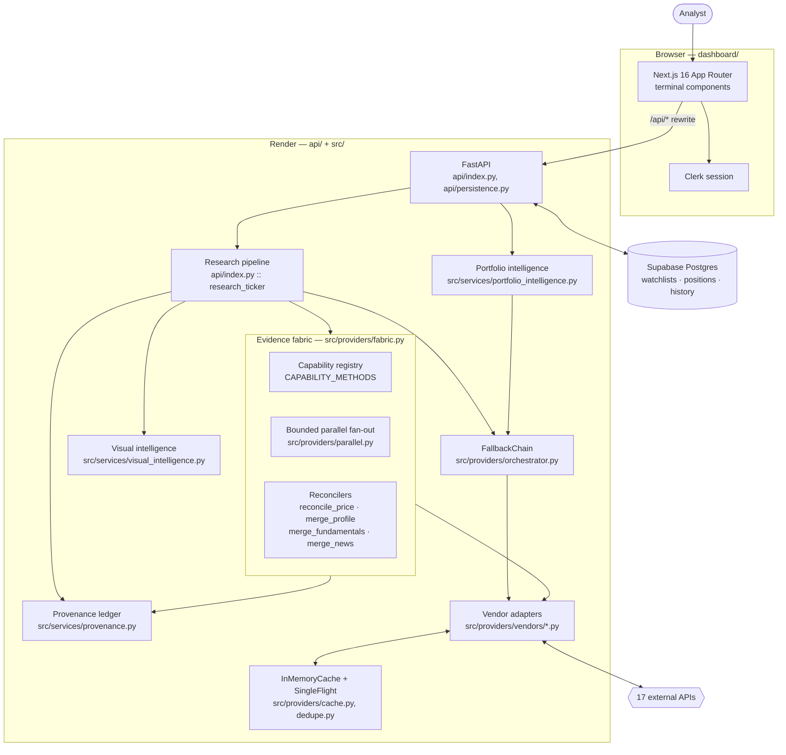
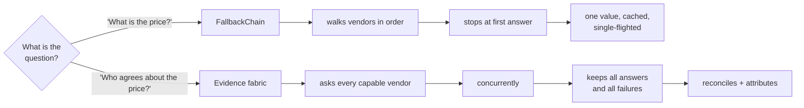
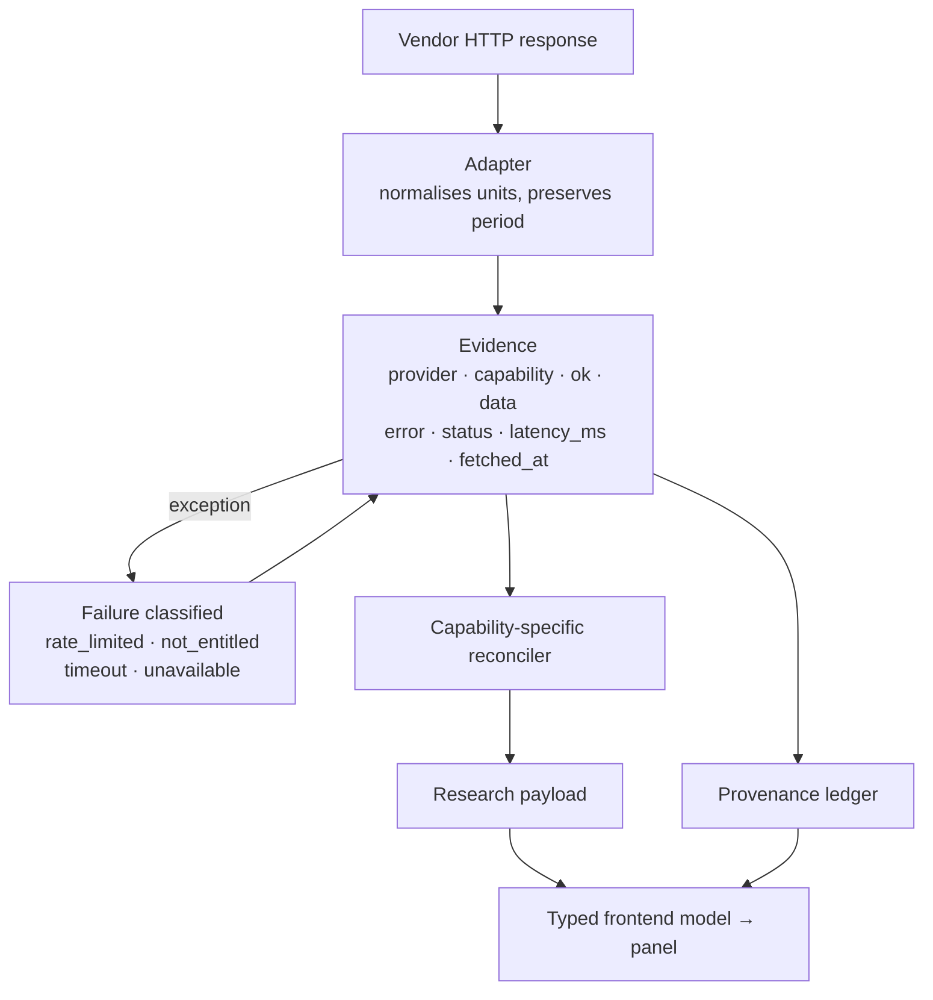
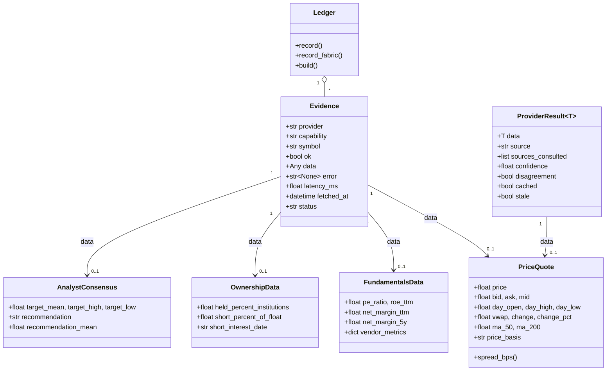
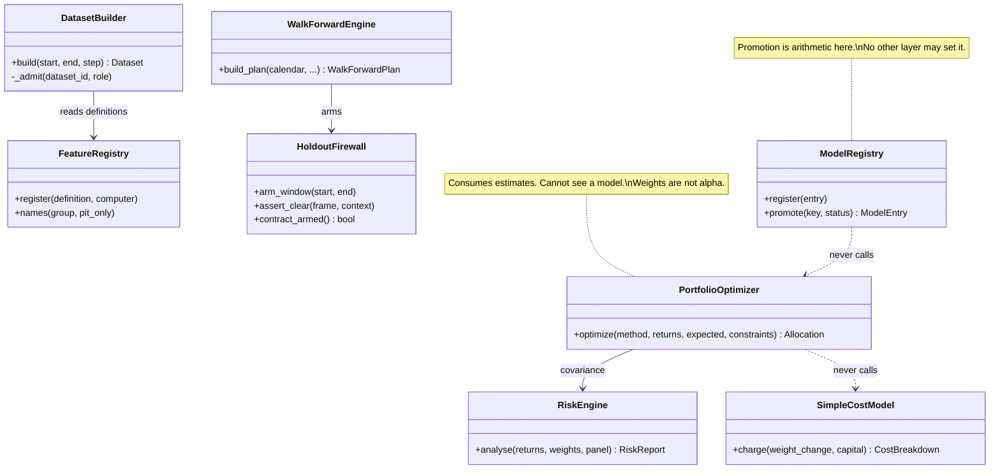
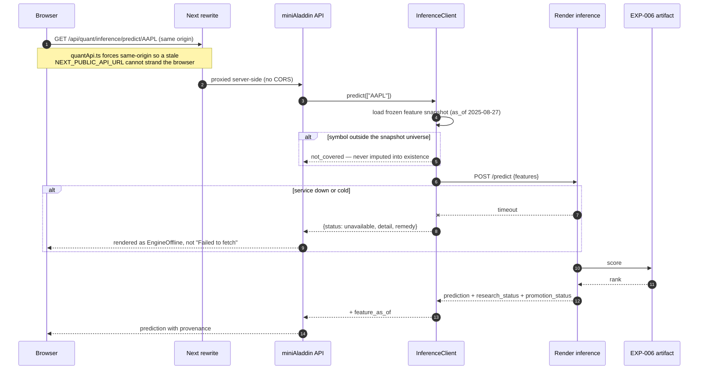

# Architecture

Derived from the code, not from intent. Every component named here maps to a
file you can open.

## System context

`next.config.ts` rewrites `/api/*` to `BACKEND_ORIGIN`. There is no serverless
Python on Vercel and no queue, broker or worker anywhere in this system.

## The two retrieval modes, and why both exist

This is the single most important thing to understand about the codebase, and
the distinction is documented in the module docstring of
`src/providers/providers.py`.

The chain backs the scoring engine, the batch quotes endpoint and the
portfolio series loader — callers that want *a price, now*. Running a
six-vendor fan-out on a watchlist refresh would multiply its cost by six for a
caller that wants one number.

The fabric backs research surfaces and the provenance ledger, where the
interesting output is the *agreement*, not the value. Both draw on the same
vendor objects, rate limiters and cache, so a fan-out following a chain for the
same symbol is largely free.

Replacing either with the other would be wrong in a specific way: chain-only
throws away the four vendors that also knew the answer; fabric-only makes every
watchlist tick six times more expensive.

## Evidence lifecycle

A failure produces an `Evidence` object exactly like a success does. That is
the whole point: "Polygon was asked and timed out" is a fact the reader needs,
and dropping it makes a degraded run indistinguishable from a narrow one.

## Domain model

`FundamentalsData` carries `net_margin_ttm` **and** `net_margin_5y` as separate
fields on purpose. A trailing margin and a five-year average are different
measurements; one field named `margin` would invite a reconciler to average
them.

## CRC

| Component | Responsibilities | Collaborators |
|---|---|---|
| `fabric.collect` | discover capable vendors by method introspection; fan out concurrently; classify failures; record latency | `parallel.map_concurrent`, vendor adapters, `Evidence` |
| `fabric.reconcile_price` | median consensus, range, dispersion, agreement count, conflict flag; attribute session fields per vendor | `Evidence`, `PriceQuote` |
| `fabric.merge_profile` | union identity fields; prefer GICS over SIC; flag numeric conflicts | `Evidence`, `CompanyProfile` |
| `fabric.merge_fundamentals` | union statement lines; surface disagreement; never average | `Evidence`, `Fundamentals` |
| `fabric.merge_news` | dedupe by URL then canonical title; record corroboration | `Evidence`, `NewsHeadline` |
| `FallbackChain.execute` | serve one value: cache → healthy vendors in order → stale cache | `VendorClient`, `InMemoryCache`, `SingleFlight` |
| `VendorClient` | key management, token-bucket limiting, timeout, bounded retry, circuit cooldown, health stats | `RateLimiter`, `VendorStats` |
| `Ledger` | assemble the chain of custody; classify input health; carry per-vendor rosters | `Evidence`, `ProviderResult` |
| `portfolio_intelligence` | valuation, concentration, volatility, drawdown, correlation, contribution, benchmark | positions, stored analyses, price series |
| `visual_intelligence` | brand identity, deterministic image query, concurrent search, rank, dedupe, cache | Logo.dev, Pexels, Unsplash |

---

## Quant research subsystem

Full treatment in [`docs/quant.md`](quant.md). The shape, and the one property
that distinguishes it from the evidence fabric: **the quant path refuses by
default.** The evidence fabric's job is to gather everything available and mark
its provenance; the quant path's job is to reject anything whose provenance is
not good enough to train on, because a leak makes results *better* and is
therefore invisible exactly when it matters.

```mermaid
flowchart LR
    subgraph IN["Local Dolt clones (14 GB, never in git)"]
        S["stocks · options · earnings · rates"]
    end
    subgraph ADMIT["Admission"]
        C["DatasetCatalog<br/>PIT class per source"]
        M["Manifest status<br/>stricter of the two wins"]
    end
    subgraph BUILD["Point-in-time build"]
        U["UniverseHistory"] --> A["CorporateActions"] --> F["FeatureEngine (103)"] --> L["LabelEngine"]
    end
    subgraph GATE["Guards"]
        T["Truncation invariance"]
        N["Negative controls"]
        FW["HoldoutFirewall"]
    end
    subgraph EVAL["Evaluation"]
        W["WalkForward"] --> MD["Models"] --> B["Backtest"] --> R["Risk"]
    end
    S --> C --> M -->|admitted| U
    M -->|refused| X["ValueError"]
    L --> T --> N --> W
    FW -.->|guards every fit| MD
    R --> REG["ModelRegistry<br/>gated promotion"] --> API["/api/quant/*"] --> UI["/quant"]
```

### CRC — quant components

| Class | Responsibilities | Collaborators |
|---|---|---|
| `DatasetCatalog` | Classify every source point-in-time and survivorship; refuse the inadmissible | `DatasetBuilder` |
| `DatasetBuilder` | Assemble the PIT panel; enforce admission; record provenance | Catalog, RawStore, features |
| `FeatureRegistry` | Definition, lookback, direction, leakage note per feature; refuse unregistered | builder, audit |
| `HoldoutFirewall` | Refuse holdout rows at every guarded stage; lift only on an armed contract | walk-forward, runner |
| `WalkForwardEngine` | Expanding folds with purge and embargo; reserve the holdout | Calendar, Firewall |
| `ExperimentRunner` | Execute a frozen definition; integrity, controls, models, ablation; one artifact | all of the above |
| `BacktestEngine` | Execution lag, costs, turnover; gross and net kept separate | CostModel, Attribution |
| `ModelRegistry` | Store evidence; refuse promotion on missing evidence or failing numbers | `quant_service` |
| `quant_service` | Shape artifacts for the API; compute verdicts from the registry's own gates | API, `/quant` |

---

## Quant CRC cards

Every class below **exists in the code**. Nothing here is aspirational; the file
path is given so a reader can check.

| Class | Responsibilities | Collaborators |
|---|---|---|
| **`DatasetCatalog`** `quant/datasets/catalog.py` | Declare each source's point-in-time and survivorship class; refuse inadmissible ones; carry measured coverage | `DatasetBuilder`, `ml_service` |
| **`RawStore`** `quant/datasets/store.py` | Persist immutable partitions with a manifest; record what was ingested and when | `LocalDoltClient`, `DatasetBuilder` |
| **`LocalDoltClient`** `quant/datasets/local_dolt.py` | Stream query results from a local clone without materialising the table | `RawStore`, ingest scripts |
| **`UniverseHistory`** `quant/pit/universe.py` | Survivorship-free monthly membership from whole-market cross-sections | `DatasetBuilder`, `cross_section` |
| **`DatasetBuilder`** `quant/pit/dataset.py` | Assemble the point-in-time panel; enforce admission (catalog **and** ingested status); record provenance | Catalog, RawStore, feature modules, `LabelEngine` |
| **`FeatureRegistry`** `quant/features/registry.py` | Hold every feature's definition, lookback, direction hypothesis and leakage note; refuse unregistered features | `DatasetBuilder`, `audit.features` |
| **`TradingCalendar`** `quant/pit/calendar.py` | Session arithmetic; `require_chronological` refuses unsorted input at the boundary | `LabelEngine`, `WalkForwardEngine` |
| **`HoldoutFirewall`** `quant/study/firewall.py` | Refuse holdout-dated rows at every guarded stage; lift only on an armed contract | `WalkForwardEngine`, `runner`, `build_artifact` |
| **`WalkForwardEngine`** `quant/validation/walkforward.py` | Cut expanding folds with purge and embargo; reserve the holdout; arm the firewall | `TradingCalendar`, `HoldoutFirewall` |
| **`ExperimentDefinition`** `quant/study/experiment.py` | Freeze models, targets, folds, costs, seed, feature families and trial count; hash the whole declaration | `ExperimentRunner`, `ResearchLedger` |
| **`ExperimentRunner`** `quant/study/run.py` | Execute a frozen definition: integrity, controls, models, ablation; write one artifact | everything above |
| **`PortfolioOptimizer`** `quant/portfolio/optimizer.py` | Turn estimates into weights under constraints; report feasibility and diagnostics | `RiskEngine`, `quant_portfolio_service` |
| **`Constraints`** `quant/portfolio/optimizer.py` | Value object for long-only, caps, cash floor, turnover, gross/net, group caps; refuse unsatisfiable combinations | `PortfolioOptimizer` |
| **`RiskEngine`** `quant/risk/engine.py` | Measure volatility, drawdown, VaR/CVaR (method-labelled), beta, contributions, concentration, exposure, turnover | `PortfolioOptimizer`, `quant_portfolio_service` |
| **`SimpleCostModel`** `quant/backtest/costs.py` | Charge commission, half-spread, slippage and sqrt impact on traded notional | `BacktestEngine`, `CostWaterfall` |
| **`CostWaterfall`** `quant/backtest/costs.py` | Decompose gross → commission → spread → slippage → net; flag where the sign changes | `quant_portfolio_service` |
| **`BacktestEngine`** `quant/backtest/engine.py` | Apply execution lag, build the quantile book, charge costs, produce gross and net separately | `SimpleCostModel`, `Attribution` |
| **`ModelRegistry`** `quant/models/registry.py` | Store evidence per model; refuse promotion on missing evidence **and** on failing numbers | `quant_service`, `register_experiment` |
| **`ResearchLedger`** `docs/RESEARCH_LEDGER.md` | Append-only record of every study, its trial count and its decision; void studies retained | `ExperimentDefinition`, significance |
| **`InferenceService`** `services/inference/app.py` | Load one artifact at startup; serve health, model card and predictions with provenance | `inference_client` |
| **`InferenceClient`** `src/services/inference_client.py` | Reach the model service with a bounded timeout; degrade to a structured `unavailable` | API routes |
| **`quant_service`** `src/services/quant_service.py` | Shape artifacts for the API; compute verdicts from the registry's own gate constants | API, `/quant` |
| **`quant_series`** `src/services/quant_series.py` | Derive per-fold IC and the cumulative rank-spread path from the predictions artifact | API, `QuantCharts` |
| **`quant_portfolio_service`** `src/services/quant_portfolio_service.py` | Build a book from predictions; measure risk and cost | `PortfolioOptimizer`, `RiskEngine`, `CostWaterfall` |
| **`SearchBudget`** `quant/study/search.py` | Declare configurations per family per stage; project worker-seconds; price the search in significance before it runs | `SearchPlan`, `train`, `heavy_run` |
| **`Axis`** `quant/study/search.py` | One hyperparameter, its sampling law and why it matters; drawn from a seeded generator | `SearchBudget`, `GpuModelSpec` |
| **`Checkpoint`** `quant/study/heavy.py` | Append one JSONL line per completed configuration; skip torn and unusable lines on reload | `evaluate_batch`, `run_search`, `quant_search_service` |
| **`ConfigResult`** `quant/study/heavy.py` | One configuration's outcome — the unit of the checkpoint and of the trial count | `Checkpoint`, `Gate`, `quant_search_service` |
| **`SearchContext`** `quant/study/heavy.py` | Hold the panel, manifest and calendar built once; cache one walk-forward plan per target | `evaluate_batch`, `select_candidate` |
| **`Gate`** `quant/study/heavy.py` | One predeclared pass/fail bar with its observed value and requirement; never a weighted score | `evaluate_gates`, `SelectionVerdict` |
| **`GpuModelSpec`** `quant/models/gpu.py` | Resolve the CUDA families without touching the CPU factory; picklable across a loky boundary | `win_gpu_worker`, `evaluate_specs` |
| **`quant_search_service`** `src/services/quant_search_service.py` | Serve a running search from its checkpoint and a finished one from its artifact; label everything partial while it runs | API, `SearchLab` |

### Layer boundaries, enforced

### Inference sequence

