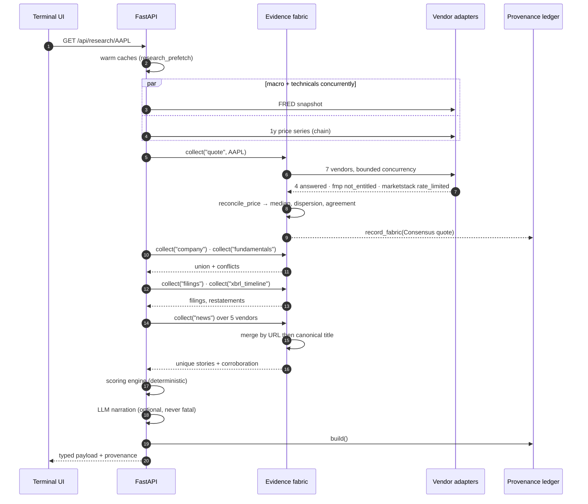
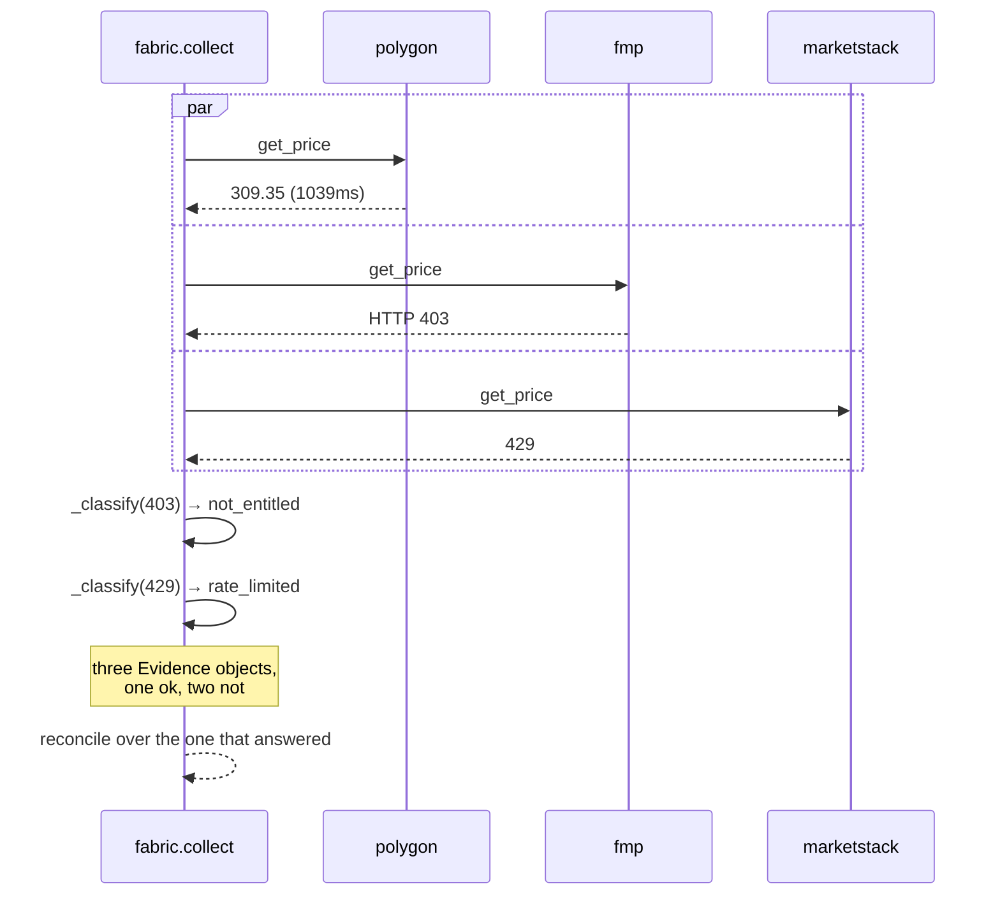
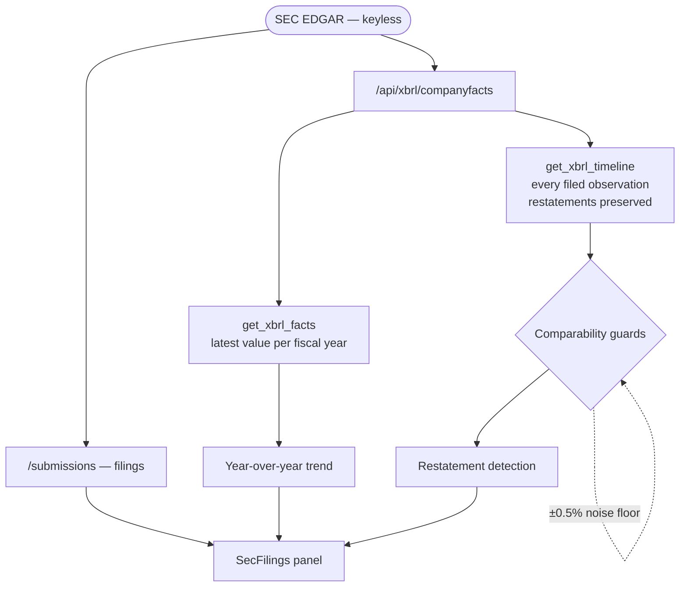
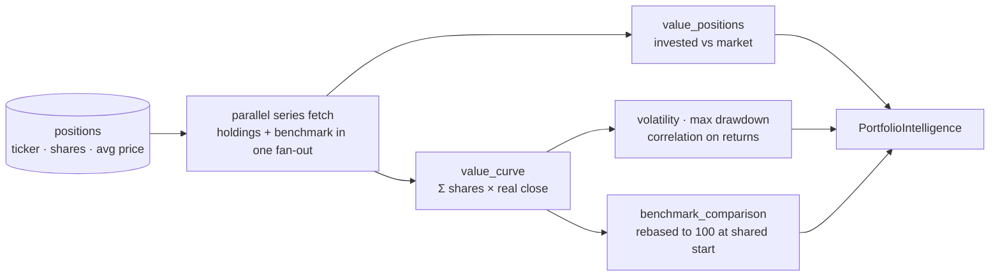
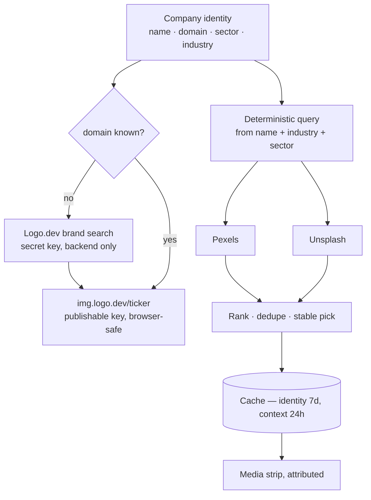

# Data flow

## A research request, end to end



Steps 8–9 are the shape that matters: **two vendors failed and the request
succeeded.** Their failures travel into the ledger as evidence rather than
vanishing.

## Failure, in detail



`fmp` answering 403 is an entitlement boundary, not an outage. Classifying it
as such keeps the circuit breaker from cooling the whole vendor down and taking
its working endpoints with it.

## SEC / XBRL and restatement detection



The **period start** guard is not theoretical. Grouping on period *end* alone
produced 106 "restatements" for Apple, the largest a fictitious −77% — both
values filed on the same day, because a 10-K carries the fiscal-year figure and
the Q4 that shares its end date. Adding `start` took it to 9 real ones: Apple's
2009 retrospective adoption of ASU 2009-13, refiled a year later.

## Portfolio



The benchmark rides the same fan-out as the holdings rather than being a
separate call after them. The output is labelled **return difference**, never
alpha: no beta is estimated and no risk-free rate is subtracted.

## Visual intelligence



Logo.dev is **identity**; Pexels and Unsplash are **context**. They are not
interchangeable, and a stock photograph is never presented as a company's own
image. The two image providers run concurrently — neither is the other's
fallback.

---

## Quant: a dataset build, end to end

The distinguishing feature of this path is where it *stops*. Each stage can
refuse, and the refusal names the source and the reason rather than degrading to
a partial answer — a silently incomplete panel is the one failure that makes
results look better.

```mermaid
sequenceDiagram
    autonumber
    participant R as ExperimentRunner
    participant C as Catalog
    participant S as RawStore
    participant U as UniverseHistory
    participant F as FeatureEngine
    participant G as Guards
    participant W as WalkForward
    participant FW as HoldoutFirewall

    R->>C: admit(source, role="feature")
    alt not point-in-time (catalog OR manifest)
        C-->>R: ValueError — named source, named reason
    end
    C->>S: read partitions
    S-->>F: frame + manifest
    R->>U: membership per date (survivorship-free)
    F->>F: per-symbol features (chronology enforced)
    F->>F: as-of joins — options, earnings, estimates, fundamentals
    Note over F: statement tables joined FORWARD to<br/>earnings_calendar; no announcement -> dropped
    F->>F: cross-sectional ranks, fitted per date
    F-->>G: panel
    G->>G: truncation invariance at 3 cutoffs
    alt integrity fails
        G-->>R: abort — no result is admissible
    end
    G->>G: negative controls
    alt a blocking control finds signal
        G-->>R: abort BEFORE any model is fitted
    end
    G->>W: plan folds
    W->>FW: arm_window(holdout_start, holdout_end)
    loop every fold
        W->>FW: assert_clear(train), assert_clear(validation)
        alt holdout rows present
            FW-->>W: HoldoutBreach — nothing is computed
        end
        W->>W: fit, predict, score
    end
```

### Timestamp semantics, per source

| Source | `date` means | Usable as-dated? |
|---|---|---|
| `ohlcv` | the session it describes | yes |
| `split` / `dividend` | ex-date | yes |
| `us_treasury` | observation | yes |
| `volatility_history` / `option_chain` | observation | yes |
| **`eps_estimate` / `sales_estimate`** | **estimate vintage** | **yes** |
| `earnings_calendar` | announcement | yes |
| `eps_history` | fiscal period end | **no — gate required** |
| `income_statement`, `balance_sheet_*`, `cash_flow_statement` | fiscal period end | **no — gate required** |

The last two rows are the whole reason `features/fundamentals.py` exists. AAPL's
quarter ending 2026-06-30 was announced 2026-07-30; reading the period-end date
as an availability date grants a month of hindsight on every quarterly figure.
