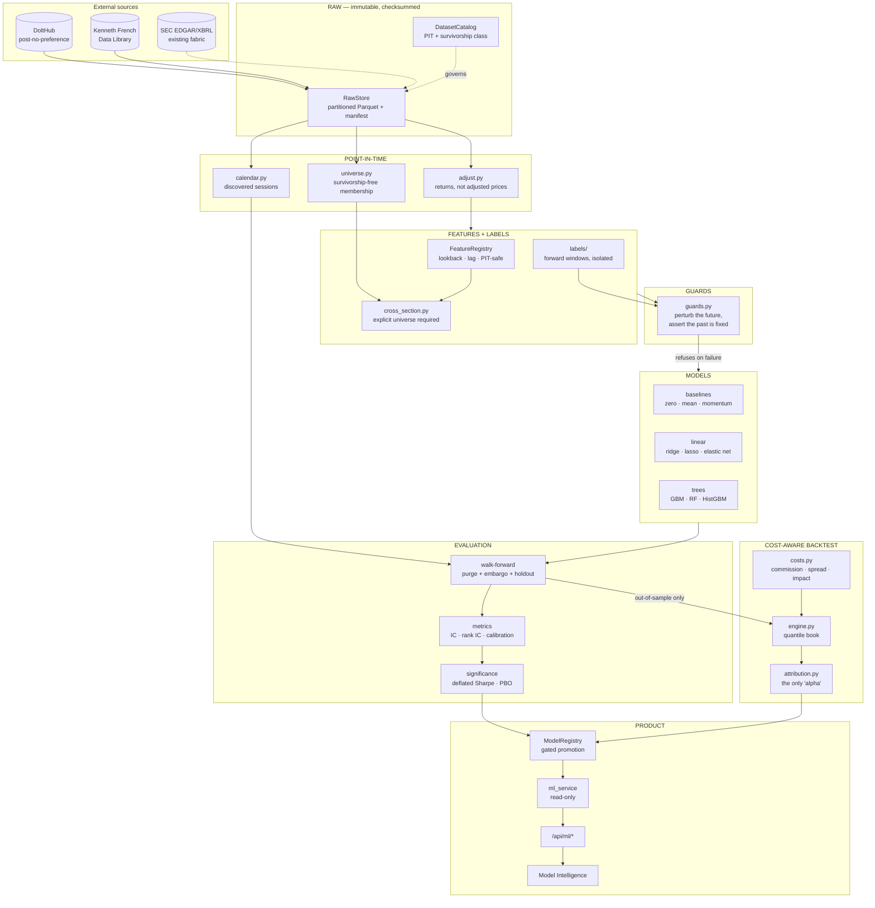
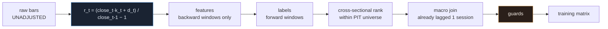
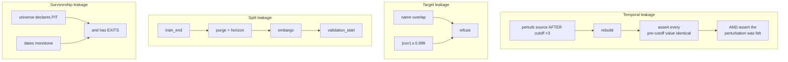
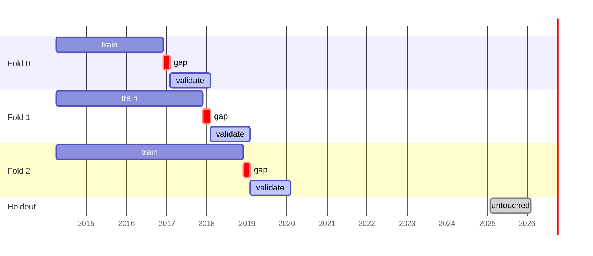
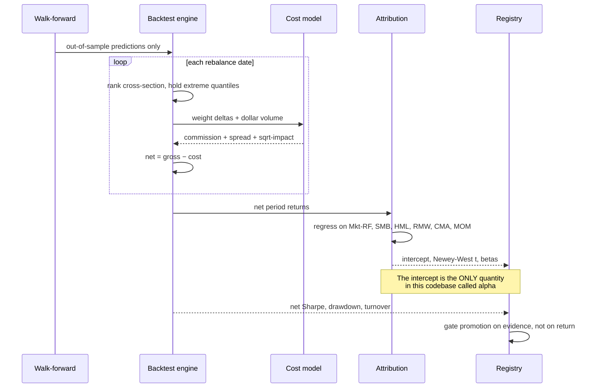

# The Machine-Learning Layer

> A model trained on future information is worthless, and the failure is
> invisible in the results — it makes them look *better*. Every architectural
> decision below follows from that one sentence.

This document describes the layer added on top of OmniSignal's evidence fabric
and point-in-time factor panel. It does not replace either. The fabric still
answers "who says so, and how far apart are they"; the panel still answers
"what would the engine have said on 2023-06-15". This layer answers a third
question the product could not previously ask:

**Given only what was knowable at time T, can a model rank the cross-section
better than a factor available since 1993 — and does the answer survive
transaction costs, regime changes, and the number of models we tried?**

Frequently the answer is no. That is a result, and the system is built to
report it rather than to keep searching until it isn't.

---

## 1. The constraint this layer was built to remove

`docs/PANEL.md` names two limitations and, correctly, declines to fake
solutions for them:

> **§5.1 Survivorship bias.** `Universe` returns **current** membership... which
> silently inflates every backtest statistic computed over it. Fixing this
> requires point-in-time index membership, which has no free source.

> **§5.2 Vendor history depth.** The provider chain's free tiers cap daily
> history at roughly **501 bars (~2 years)**... usable panel depth today is
> roughly **one year**, not five.

Both are now removed, and both by the same source. `post-no-preference/stocks`
on DoltHub carries daily bars from **2011-01-03** with **3,844 symbols on the
first day and 12,470 on the last**, and its security master records
`last_seen` — so a universe can be selected from what was liquid in the past
rather than filtered by what survived to the present.

The verification that mattered was not the row count. It was this:

```
SIVB  2023-03-08  close 267.83
SIVB  2023-03-09  close 106.04   (-60.4%)
SIVB  2023-03-10  (no bar — trading halted)
```

Silicon Valley Bank is in the data, with its collapse, and then it stops. Its
`symbol` row reads `financial_status = 'Bankrupt'`. A survivors-only dataset
contains none of that, and every risk statistic computed over one is measuring
a world in which regional banks did not fail.

---

## 2. System architecture



The arrow from `LEAK` to `MODEL` is labelled *refuses on failure* rather than
*warns*. `DatasetBuilder.build()` raises when a guard fails; it does not return
a matrix with a warning attached, because a warning is something a training
script ignores.

---

## 3. The point-in-time pipeline



### Why returns, not adjusted prices

The conventional back-adjusted price series is **structurally incapable** of
being point-in-time: the value it shows for 2015 depends on a split that
happened in 2020, and rebuilding it after a new split changes every historical
number. A model trained on Tuesday's history and evaluated against Wednesday's
is not being evaluated on what it trained on.

So `src/quant/pit/adjust.py` computes

```
r_t = (close_t · k_t + d_t) / close_{t-1} − 1
```

where `k_t` is the split ratio for an action with `ex_date == t` and `d_t` is
the cash dividend with `ex_date == t`. **Every term is dated `t`.** Nothing
after `t` appears anywhere in the expression, so there is no adjustment to
invalidate. `adjusted_price_series()` exists for charts, takes a mandatory
`as_of`, and is refused by everything upstream of a model.

### Ordering, and why each stage sits where it does

| Stage | Before | After | Reason |
|---|---|---|---|
| Features | returns | cross-section | Needs one symbol's own history |
| Cross-sectional rank | features | macro join | Macro values are common to every name on a date and would standardise to exactly zero — destroying the feature while appearing to work |
| Observation stride | features | universe | Striding first would make a 252-session lookback span five calendar years under a one-year name |
| Guards | everything | nothing | They check the assembled matrix, so they catch whatever produced it |

---

## 4. Leakage control

Four failure modes, each with a guard that can demonstrably fail.



The fourth check in the temporal guard — *assert the perturbation was felt* —
is the one that keeps the other three honest. Without it, a builder that
ignored its input entirely would pass. `tests/quant/test_leakage.py` contains
paired tests: a centred rolling mean and a `shift(-1)` feature must both fail,
and they do.

**Purge and embargo are separate parameters** because they answer separate
questions. Purge covers the *label's* reach — a 21-session label observed on
the last training day is realised 21 sessions into validation. Embargo covers
*serial correlation*, which persists past the horizon. Collapsing them loses
the ability to say which one a result was sensitive to.

---

## 5. Walk-forward validation



No random split. Financial panel rows are non-exchangeable in two independent
ways, and each alone invalidates one: **time** (training on 2022 to test 2018
answers a question nobody has) and **overlap** (a 21-session label sampled
every 5 sessions shares 16 of its 21 days with its neighbour, so a random split
puts rows sharing 76% of their outcome on both sides of the boundary).

The **holdout is not a fold**. It is carved off before any fold is generated,
returned by no iterator, and evaluated by nothing in the validation package.
It exists so that after selection has consumed the validation folds — and it
always does — one period remains that no decision has touched.

---

## 6. From prediction to money



**Positions are formed from the prediction at `t` and earn the return from `t`
to the next rebalance — never `t`'s own return.** That single off-by-one is the
most common backtest error there is, and it manufactures performance exactly
proportional to how good the signal is.

**Costs are charged per rebalance**, not deducted annually at the end.
Deducting at the end always flatters, because a strategy trades hardest exactly
when it is most confident and the naive method assumes an average.

---

## 7. Terminology, held to the repository's standard

`src/services/backtest_service.py` already refuses to call a benchmark
difference alpha. This layer extends the same discipline:

| Quantity | Where it may be produced | What it means |
|---|---|---|
| Return difference | anywhere | strategy return minus benchmark return |
| Gross / net return | `backtest/engine.py` | before / after modelled costs |
| Rank IC | `validation/metrics.py` | Spearman correlation of prediction and forward return, per date |
| **Alpha** | **`backtest/attribution.py` only** | intercept of a six-factor regression, with a Newey-West t-statistic |

`tests/quant/test_backtest.py::test_no_metric_is_named_alpha` asserts the
backtest engine emits no key containing "alpha".

---

## 8. What is deliberately absent

* **White's Reality Check and Hansen's SPA.** Both need a stationary bootstrap
  with a correctly chosen block length; getting it wrong silently changes the
  answer. Deflated Sharpe and PBO are implemented instead, and this gap is
  recorded in `docs/modeling-methodology.md`.
* **CPI, unemployment, GDP.** Released on a schedule *and revised afterwards*,
  so using them honestly needs a vintage database (ALFRED). The Treasury curve
  is used because it is not revised.
* **Sector neutralisation.** `sector_neutralise()` exists and is unused: there
  is no point-in-time sector classification here, and applying today's GICS to
  2013 backdates a classification that has itself been revised.
* **Option chains.** 8.58 GB, catalogued and not ingested. `volatility_history`
  supplies IV level, IV rank and the IV-RV spread for a fraction of the cost,
  and paying the largest engineering cost in the catalog before those are shown
  to carry signal is an unmeasured bet.

---

## 9. CRC cards

### `DatasetBuilder`
**Responsibilities** — assemble a point-in-time training matrix; refuse
non-admissible sources; run leakage guards and raise on failure; emit a
manifest with a content hash.
**Collaborators** — `RawStore`, `DatasetCatalog`, `UniverseHistory`,
`FeatureRegistry`, `labels`, `guards`, `TradingCalendar`.

### `FeatureRegistry`
**Responsibilities** — hold each feature's definition, lookback, availability
lag and point-in-time declaration; refuse duplicate registration; report
unsafe features by name.
**Collaborators** — `DatasetBuilder`, `guards`, `ml_service`.

### `UniverseHistory`
**Responsibilities** — answer membership as of any date from the latest prior
rebalance; report turnover and exits; expose the union for ingestion.
**Collaborators** — `RawStore`, `DatasetBuilder`, `cross_section`, `guards`.

### `WalkForwardPlan`
**Responsibilities** — generate chronological folds with purge and embargo;
reserve an untouched holdout; verify no fold overlaps.
**Collaborators** — `TradingCalendar`, `run_walk_forward`, `guards`.

### `Model`
**Responsibilities** — fit, predict, explain, fingerprint; refuse non-finite
input; refuse prediction before fitting.
**Collaborators** — `FoldImputer`, `run_walk_forward`, `ModelRegistry`.

### `BacktestEngine`
**Responsibilities** — form quantile books from out-of-sample predictions;
charge costs per rebalance; report gross, net, turnover and risk.
**Collaborators** — `SimpleCostModel`, `attribution`, `significance`.

### `ModelRegistry`
**Responsibilities** — store models with their evidence; refuse promotion whose
evidence is absent; rank with the numbers that argue against each model.
**Collaborators** — study runner, `ml_service`.

### `MLService`
**Responsibilities** — read study artifacts; report `unavailable` with a
remediation rather than estimating; tag every value OBSERVED / DERIVED /
MODEL_PREDICTED; assemble the provenance chain.
**Collaborators** — `RawStore`, `ModelRegistry`, `/api/ml/*`.

---

## 10. Reading order

1. `docs/dataset-catalog.md` — what was measured, and what was rejected.
2. `docs/research-data.md` — ingestion, storage, and the query-shape constraint.
3. `docs/modeling-methodology.md` — features, labels, models, and the results.
4. `docs/backtesting.md` — costs, attribution, significance.
5. `docs/model-registry.md` — promotion gates.
