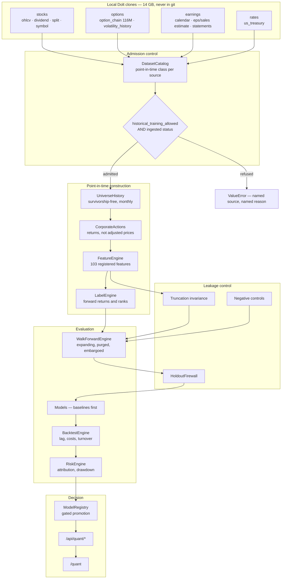
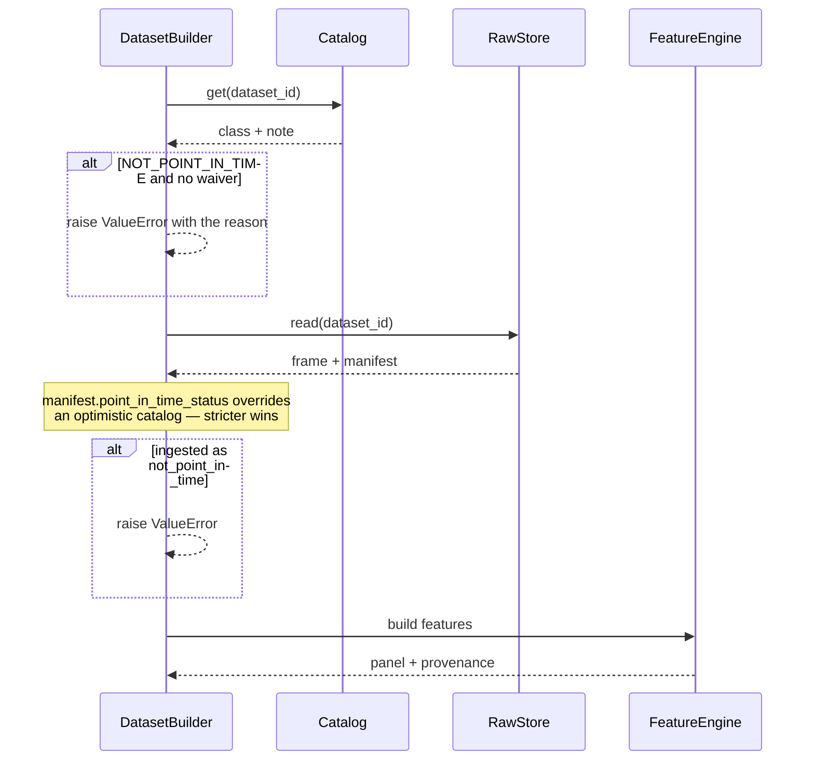
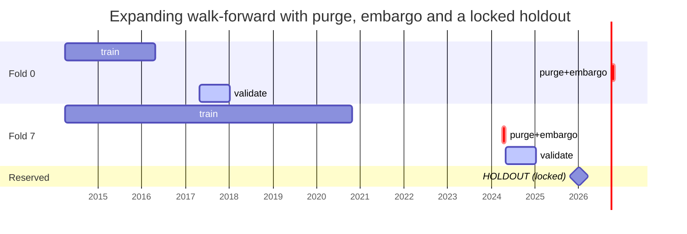
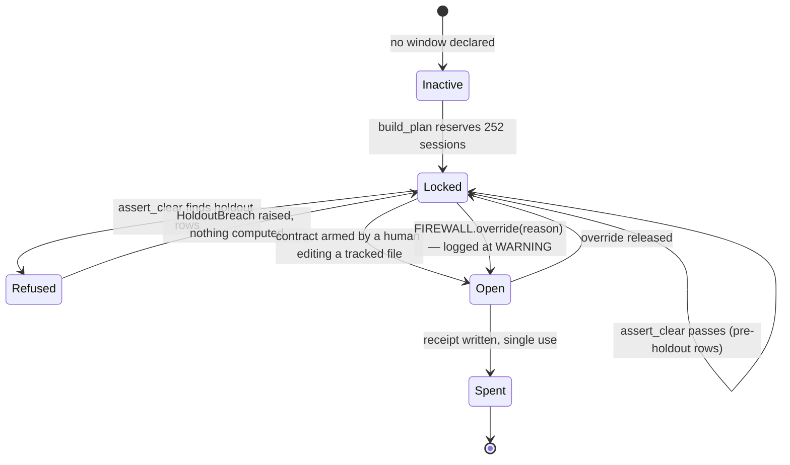
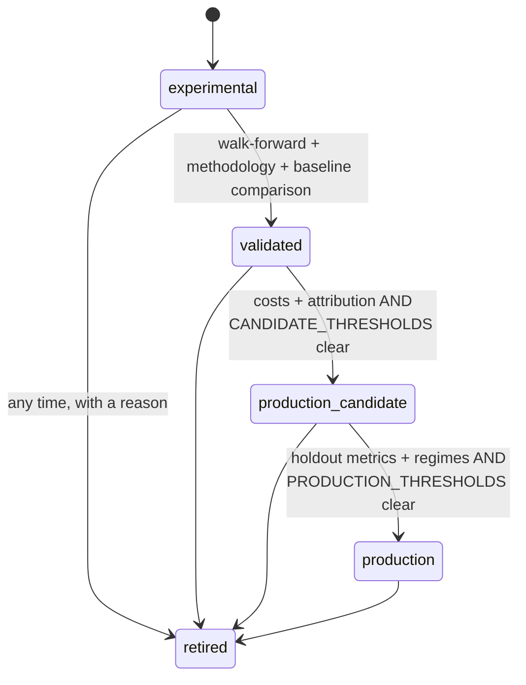
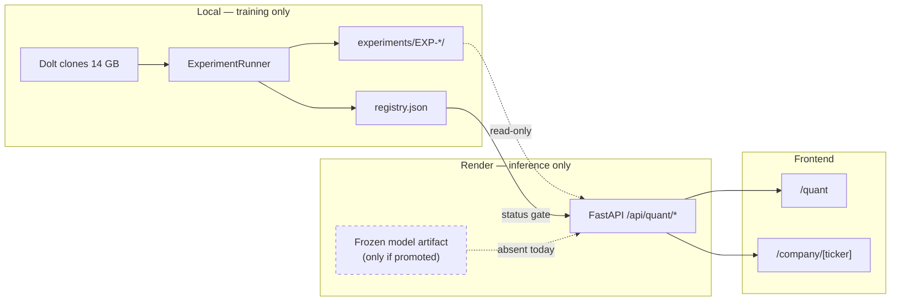
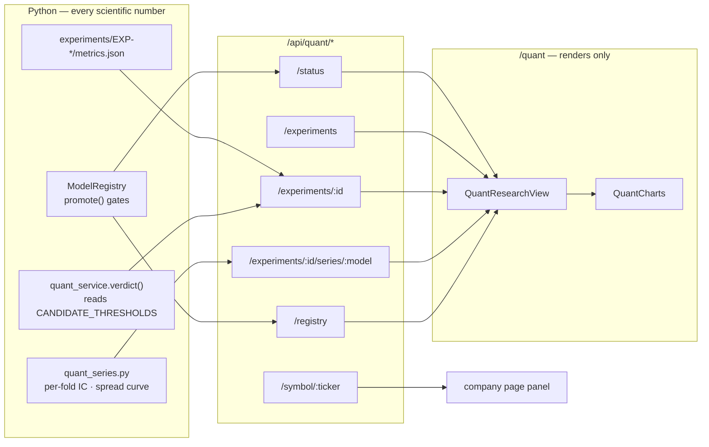

# The Quant Research System

> The objective is not accuracy. It is a statistically defensible, economically
> meaningful, out-of-sample signal that survives realistic costs and
> multiple-testing correction. As of EXP-005 no such signal has been found, and
> the system is built so that saying so is as easy as saying the opposite.

---

## 1. What this system is for

Most of the machinery here exists to make a *negative* result trustworthy. That
is a deliberate inversion. A pipeline that can only be trusted when it produces
good news is worthless, because the good news is exactly the case where a
look-ahead bug is invisible — a leak makes results better, never worse, so the
moment a number looks impressive is the moment the pipeline is least likely to
be examined.

So the design bias runs the other way. Sources are refused rather than flagged.
Controls block rather than warn. The holdout is defended by a runtime guard, not
a convention. Promotion is gated on evidence *and* on what the evidence says.
Every one of those has fired at least once on real work in this repository, and
each time it fired it was right.

---

## 2. Architecture



---

## 3. The point-in-time contract

Every source is classified, and the classification is **enforced at read time**,
not documented and hoped for.

| Class | Meaning | Sources |
|---|---|---|
| `POINT_IN_TIME` | Knowable on its own date | ohlcv, split, dividend, treasury, volatility_history, option_chain, **eps_estimate**, **sales_estimate** |
| `PUBLICATION_LAGGED` | Real but not as-dated; needs a gate | eps_history, earnings_calendar, **income_statement**, **balance_sheet_***, **cash_flow_statement** |
| `NOT_POINT_IN_TIME` | Refused as a feature source | (none currently) |



### The distinction that matters most

`income_statement.date` is a **fiscal period end**, not a filing date. Verified:

| Symbol | Period end | Announced | Lag |
|---|---|---|---|
| AAPL | 2026-06-30 | 2026-07-30 | 30d |
| AAPL | 2025-12-31 | 2026-01-29 | 29d |

270,888 of 270,925 rows fall on a month end. Reading that column as an
availability date grants a model a month of hindsight on every quarterly figure.
`src/quant/features/fundamentals.py` therefore joins each period **forward** to
its first `earnings_calendar` announcement and drops any period whose
announcement cannot be established — 77,277 of 196,879 quarters, all of them
pre-2020 where the calendar has no coverage.

**What that does not fix:** there is one row per period and no vintage column, so
a restatement overwrites the original irrecoverably. Every feature derived from
these tables carries `restatement_risk=UNQUANTIFIED`, and they are isolated in
their own ablation arm so their contribution can be discounted separately.

### The one clean fundamental source

`eps_estimate` and `sales_estimate` are keyed by **observation date** — 7,060,412
weekly vintages each. A row says what consensus was that Sunday, and it was
knowable that Sunday:

```
AAPL, period ending 2026-06-30
  2026-02-01  consensus 1.70   count 9
  2026-04-12  consensus 1.68   count 9    <- a downward revision
  2026-04-19  consensus 1.73   count 9    <- and back up
```

No gate is required. The trap here is different: `period` is *relative*
('Current Year'), so at a fiscal rollover the label starts describing a different
year and the consensus jumps. Differencing across that boundary manufactures an
enormous revision on a predictable calendar — precisely the spurious regularity a
tree model will fit. Revisions are therefore computed only where
`period_end_date` is unchanged between vintages.

---

## 4. Walk-forward validation



Rules, each enforced in code:

* **Expanding, never random.** A random split on a temporal panel trains on the
  future. There is no code path that produces one.
* **Purge** by the label horizon (21 sessions): a training row whose forward
  label overlaps the validation window is removed.
* **Embargo** a further 5 sessions for serial correlation.
* **Execution lag** of 1 rebalance period. A signal computed from the close of
  *t* forms a position at *t+1*. `execution_lag_periods` refuses a value below 1.
* **Holdout** of the final 252 sessions, reserved before any fold is cut.

---

## 5. The holdout firewall

The CLI runner refused to *run the holdout experiment* unarmed. That protected
one entry point and did nothing about the way a holdout actually gets spent —
someone builds a panel that extends past the cutoff, fits something, and sees the
number before realising. By then it is gone.



`FIREWALL.assert_clear` is called at the walk-forward plan, and again on both
the train and validation frames of **every fold, immediately before the fit**.
There is deliberately **no environment variable** that opens it —
`QUANT_DISABLE_HOLDOUT_FIREWALL` raises if set, so a hopeful export fails loudly
rather than silently doing nothing.

---

## 6. Model lifecycle



Two independent refusals, and both are needed:

* `PROMOTION_GATES` asks whether the required evidence **exists**.
* `CANDIDATE_THRESHOLDS` / `PRODUCTION_THRESHOLDS` ask what the evidence **says**.

Before EXP-005 only the first applied at `production_candidate`, so a model could
arrive with a complete, honest evidence bundle stating that it loses money and
still be labelled a candidate. EXP-004's best model is exactly that bundle.

---

## 7. CRC cards

| Class | Responsibilities | Collaborators |
|---|---|---|
| **DatasetCatalog** | Declare every source's point-in-time and survivorship class; refuse inadmissible ones | DatasetBuilder, ml_service |
| **RawStore** | Persist immutable partitions with a manifest; record what was ingested and when | LocalDoltClient, DatasetBuilder |
| **LocalDoltClient** | Stream query results from a local clone without materialising the table | RawStore, ingest scripts |
| **UniverseHistory** | Produce survivorship-free monthly membership from whole-market cross-sections | DatasetBuilder, cross_section |
| **DatasetBuilder** | Assemble the point-in-time panel; enforce admission; record provenance | Catalog, RawStore, FeatureEngine, LabelEngine |
| **FeatureRegistry** | Hold every feature's definition, lookback, direction and leakage note; refuse unregistered features | DatasetBuilder, audit.features |
| **LabelEngine** | Compute forward returns and cross-sectional ranks without reaching past the panel | DatasetBuilder, calendar |
| **HoldoutFirewall** | Refuse holdout-dated rows at every guarded stage; lift only on an armed contract | WalkForwardEngine, runner |
| **WalkForwardEngine** | Cut expanding folds with purge and embargo; reserve the holdout | Calendar, HoldoutFirewall |
| **ExperimentRunner** | Execute a frozen definition; run integrity, controls, models, ablation; write one artifact | everything above |
| **BacktestEngine** | Apply execution lag, costs and turnover; produce gross and net separately | Attribution, CostModel |
| **RiskEngine** | Factor attribution, drawdown, concentration, turnover | BacktestEngine |
| **ModelRegistry** | Store evidence; refuse promotion on missing evidence or failing numbers | quant_service |
| **quant_service** | Shape artifacts for the API; compute verdicts from the registry's own gates | ModelRegistry, API |

---

## 8. Deployment



**Training never runs on Render.** The 14 GB of Dolt clones are a local
development dependency and are not a deployment dependency: inference needs the
frozen artifact and the feature schema, nothing else.

`GET /api/quant/status` returns `deployment_status ∈ {NO_MODEL, EXPERIMENTAL,
CANDIDATE, PRODUCTION}`, read from the **registry**. Today it is `NO_MODEL`, the
UI says so at full weight, and `/api/quant/symbol/{s}` returns an explicit
refusal rather than a number.

When a model does qualify, promotion is a registry state change. No part of this
architecture has to be rewritten for that to work, which was the point of
building the refusal path first.

---

## 9. The research terminal

`/quant` renders the evidence and the evidence against it. The design constraint
is that the page must read the same whether the research succeeded or failed — a
quant surface that only looks impressive when the numbers are good is a marketing
surface wearing a lab coat.



**No scientific calculation happens in TypeScript.** Rank ICs, spread curves,
fold statistics, verdicts and promotion eligibility all arrive computed. A second
implementation in the frontend would eventually disagree with the Python one, and
the page would be quietly wrong in a way no test covers.

### The sections

| # | Section | What it refuses to do |
|---|---|---|
| 1 | Deployment banner | Read anything but the registry. No leaderboard result can change `NO_MODEL` |
| 2 | Current finding | Bury the negative. `NO ROBUST EVIDENCE OF EDGE` is stated at full weight with the strongest surviving evidence beside it |
| 3 | Research overview | Omit the dataset hash, trial count, execution lag or cost assumption |
| 4 | Experiment explorer | Hide a void study. EXP-002 stays listed with its reason |
| 5 | Model comparison | Rank by IC alone. Every discounting column sits to the right of it |
| 6 | Ablation | Read the maximum t-statistic as an edge. It is labelled `HYPOTHESIS — NOT A RESULT` |
| 7 | Walk-forward | Imply a random split. Train, purge, validation and the locked holdout are drawn to scale |
| 8 | Regimes | Show a metric without its date count. Thin regimes render `INSUFFICIENT EVIDENCE` |
| 9 | Research integrity | Claim restatement handling is solved. It reads `UNQUANTIFIED` |
| 10 | Dataset coverage | Present coverage as complete |
| 11 | Model registry | Decide promotion. It renders what Python already decided, with the unmet thresholds |
| 12 | Model training | Fake a trained model. The last pipeline step reads `blocked` |

### Charts

Inline SVG, no charting dependency. Every chart carries its **units** and
**sample size** in the header and an explanation underneath, because a quant
chart without units is a decoration.

One deliberate naming decision: the cumulative curve is a **rank spread**, not an
equity curve, and it accumulates additively. The target is a cross-sectional rank
in [−1, 1]; an earlier version compounded it as a return and produced **+6,553%**
— a number that would have sat on a page headlined "no evidence of edge" and been
believed. Every Sharpe and return figure on the page comes from the artifact's
costed backtest instead.

---

## 10. Reproducing

```bash
export QUANT_DATA_ROOT=/path/to/datasets     # optional; defaults to ./datasets
python -m scripts.quant.local_backfill --stage all
python -m scripts.quant.backfill --stage universe --universe-size 250
python -m src.quant.study.run --experiment EXP-005 --workers 6
python -m scripts.quant.register_experiment --experiment EXP-005
python -m src.quant.study.holdout --preflight    # must refuse on contract_armed
```

Further reading: [FEATURES](quant/FEATURES.md) · [EXPERIMENTS](quant/EXPERIMENTS.md) ·
[VALIDATION](quant/validation.md) · [MODEL CARD](quant/model-card.md) ·
[DEPLOYMENT](quant/deployment.md) · [DATA MODEL](quant/data-model.md) · [LEDGER](RESEARCH_LEDGER.md)
