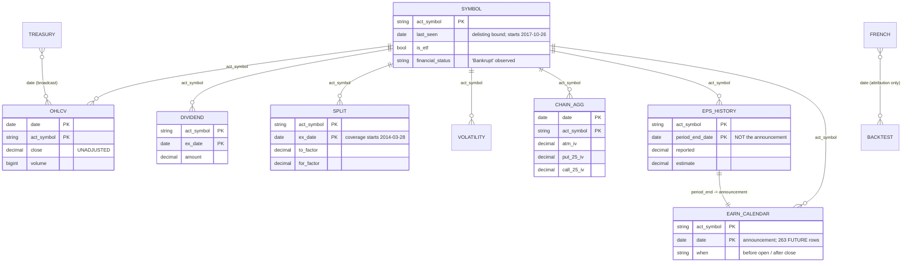
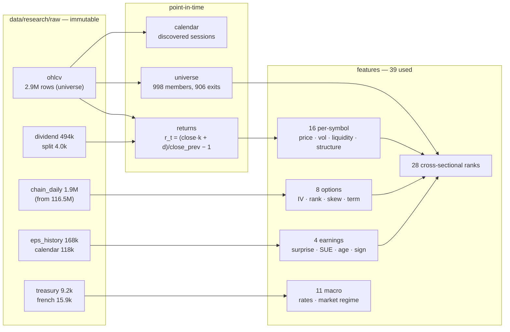

# Quant Data Model

The corpus, its keys, its joins, and the temporal semantics of every field that
enters a model.

---

## 1. Sources, as measured locally

Four Dolt repositories, cloned to `datasets/` (~14 GB) and read through the
`dolt` CLI. Row counts are from the clones, not from documentation:

| Repository | Table | Rows | Coverage |
|---|---|---|---|
| stocks | `ohlcv` | **28,928,007** | 2011-01-03 → 2026-08-28, 21,512 symbols |
| stocks | `dividend` | 494,438 | 1970-01-19 → 2026-08-21, 10,570 symbols |
| stocks | `split` | 3,993 | **2014-03-28** → 2026-08-21 |
| stocks | `symbol` | 24,058 | `last_seen` 2017-10-26 → 2026-08-22 |
| options | `option_chain` | **116,487,570** | 2019-02-09 → 2026-08-28, 2,317 symbols, 1,276 dates |
| options | `volatility_history` | 1,916,827 | 2019-02-09 → 2026-08-28, 2,322 symbols |
| earnings | `eps_estimate` | 7,060,412 | vintage-dated consensus |
| earnings | `sales_estimate` | 7,060,412 | vintage-dated consensus |
| earnings | `rank_score` | 1,765,103 | dated vendor composite scores |
| earnings | `earnings_calendar` | 117,601 | 2020-01-22 → **2026-10-01** |
| earnings | `income_statement` | 270,925 | period-dated, **no filing date** |
| earnings | `eps_history` | 168,473 | period-dated, no announcement date |
| earnings | balance sheet ×3 | ~284,000 each | period-dated |
| earnings | `cash_flow_statement` | 176,631 | period-dated |
| rates | `us_treasury` | 9,158 | 1990-01-02 → 2026-08-28 |

Local access is what makes this tractable. The aggregate
`count(*), count(distinct act_symbol), min(date), max(date)` over `ohlcv`
**times out** against the hosted SQL API and completes locally in **8.1 s**.

---

## 2. Entity relationships



The one relationship that carries the most weight is
`EPS_HISTORY ||--|| EARN_CALENDAR`. Without it `eps_history` is unusable; with
it, earnings surprise becomes a point-in-time feature.

---

## 3. Temporal semantics per field

The distinction that everything else rests on:

| Clock | Meaning | Example |
|---|---|---|
| **Period end** | the span a figure describes | `eps_history.period_end_date` = 2026-06-30 |
| **Event time** | when the observation occurred | `ohlcv.date` |
| **Publication time** | when it became public | `earnings_calendar.date` = 2026-07-30 |
| **Availability time** | first moment it could be acted on | 2026-07-31 (after-close print) |
| **Ingestion time** | when we fetched it | `manifest.retrieved_at` |

Applied to every source:

| Field | Event | Publication | Available at | Class |
|---|---|---|---|---|
| `ohlcv.close` | date | date | date's close | POINT_IN_TIME |
| `split.ex_date` | ex-date | announced earlier | ex-date (conservative) | POINT_IN_TIME |
| `dividend.ex_date` | ex-date | announced earlier | ex-date (conservative) | POINT_IN_TIME |
| `us_treasury.*` | date | date, after close | date + 1 session | POINT_IN_TIME |
| `volatility_history.iv_current` | date | date | date | POINT_IN_TIME |
| `option_chain.vol` | date | date | date | POINT_IN_TIME |
| `eps_estimate.consensus` | `date` (vintage) | `date` | `date` | POINT_IN_TIME |
| `eps_history.reported` | period end | **calendar join** | announcement + session rule | PUBLICATION_LAGGED |
| `earnings_calendar.date` | announcement | — | bounded at cutoff | PUBLICATION_LAGGED |
| `symbol.last_seen` | delisting | — | as a bound only | PUBLICATION_LAGGED |
| `french.*` | date | weeks later, **revised** | attribution only | PUBLICATION_LAGGED |
| `income_statement.*` | period end | **unknown** | never | NOT_POINT_IN_TIME |

`income_statement` is the only row in that table with no path to usability, and
it is refused in code rather than flagged in prose.

---

## 4. The derived tiers



---

## 5. Join keys

| Join | Key | Direction | Guard |
|---|---|---|---|
| bars → actions | `(symbol, date == ex_date)` | exact | only actions dated `t` affect `r_t` |
| panel → options | `(symbol, date)` | **backward** as-of | 21-day staleness cap |
| panel → earnings | `(symbol, available_from)` | **backward** as-of | 63-session freshness cap |
| panel → macro | `date` | broadcast, pre-lagged | 1-session lag at source |
| panel → universe | `date` | latest rebalance ≤ date | membership decided in the past |
| backtest → french | `date` | compounded to rebalance | attribution only |

Every as-of join is **backward**. `direction="nearest"` is the natural-looking
choice and is a leak: on a Monday it happily matches Tuesday.

---

## 6. Storage and versioning

```
data/research/
  raw/<dataset_id>/
    manifest.json          source, commit hash, PIT class, survivorship class,
                           per-partition checksums, transformations, limitations
    part-<year>.parquet    immutable, zstd, written once
  universe/liquid.json     184 monthly snapshots
  models/registry.json     gated model registry
  reports/study.json       every experiment
```

`source_version` from a local clone is the resolved **commit hash**
(`stocks@h4k31feneele009f7t15a022qjtn2970`), not a branch name. A branch moves;
a manifest recording one cannot support a reproducibility claim.

Every training matrix carries a `content_hash` over its numeric payload, so two
builds that agree on every number agree on the hash regardless of column order
or dtype width.
