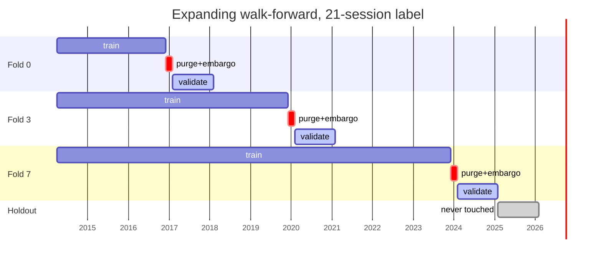

# Validation Methodology

Why the split looks the way it does, and what each part of it defends against.

---

## 1. Random splits are invalid here, twice over

A random train/test split assumes rows are exchangeable. These are not, for two
independent reasons — and either alone is disqualifying.

**Time.** Training on 2022 and testing on 2018 asks whether a model fitted with
knowledge of the future predicts the past. Nobody has that question.

**Overlap.** A 21-session label sampled every 5 sessions means consecutive
observations of the same name share **16 of their 21 days**. A random split
therefore puts rows sharing 76% of their outcome on both sides of the boundary,
so the "test" set is substantially the training set. This is the single largest
source of illusory skill in equity ML, and it produces results that look
excellent and reproduce nowhere.

---

## 2. The geometry

```
|<----------- train (expanding) ----------->|<-purge->|<-emb->|<-- validation -->|
                                        train_end                        252 sessions
```



**Expanding, not rolling, by default.** It is what a live system does — retrain
on everything available. `scheme="rolling"` is implemented and tested; when
rolling beats expanding, the honest reading is that the relationship changed,
not that the model improved.

---

## 3. Purge and embargo are different things

| Parameter | Covers | Size |
|---|---|---|
| **Purge** | the label's own reach — a label observed on the last training day is realised `horizon` sessions later | = label horizon (21) |
| **Embargo** | serial correlation in features and returns, which persists past the horizon | 5 sessions |

They are separate parameters, not one combined number, because a result's
sensitivity to each is a different question. Combined gap: **26 sessions**.

Following López de Prado, *Advances in Financial Machine Learning* (2018), ch. 7.

`assert_split_is_purged` verifies the gap fold by fold, and
`test_an_insufficient_gap_is_refused` proves the check fails when the gap is
too small.

---

## 4. The holdout is not a fold

`WalkForwardPlan.holdout` is carved off **before** any fold is generated,
returned by no iterator, and evaluated by nothing in the validation package.
Reaching it requires an explicit call, so using it is a decision that appears
in the transcript.

Once used it is spent. Selection inevitably consumes the validation folds —
that is what selection is — and the holdout exists so one period remains that
no decision touched.

**Status: unspent.** No model has passed the registry gates that would justify
spending it.

---

## 5. Metrics, and why they are reported together

| Metric | Answers | Fails alone because |
|---|---|---|
| RMSE / MAE | magnitude accuracy | dominated by unpredictable variance; nearly every model loses to zero |
| `rmse_vs_zero` | is it better than predicting nothing | — this is the honest framing of the above |
| directional accuracy | sign agreement | must be read against the **base rate**, never 50% |
| `directional_edge` | accuracy minus majority class | the only one of the three readable alone |
| **rank IC** | ordering within each date's cross-section | the metric a long/short book needs |
| `ic_ir` | mean IC over its dispersion | the closest thing a signal has to a Sharpe |
| `train_ic_gap` | did it memorise the training fold | **the overfitting diagnostic** |
| `fold_ic_positive_rate` | consistency | distinguishes 0.05-every-fold from +0.20/−0.10 |

### The Newey-West correction

Overlapping labels make consecutive IC observations dependent, and the naive
t-statistic on them is inflated — typically by about a factor of two. Lags are
`ceil(horizon / step) − 1`: at horizon 21 and stride 5 that is **4 lags**.

The implementation is `src/research/cross_section.newey_west_tstat`, **reused
rather than rewritten**, so the factor-lab surface and the ML surface cannot
report different significance for the same series.

---

## 6. Corrections for having tried many things

| Test | Question |
|---|---|
| Deflated Sharpe | does it beat the best of *N* zero-skill runs? |
| Probability of Backtest Overfitting | does in-sample selection predict out-of-sample rank? |
| Minimum Track Record Length | how many periods before this Sharpe separates from zero? |
| Blocked bootstrap | interval on IC allowing for dependence |

The bootstrap uses a **moving-block** resample. An i.i.d. bootstrap on
dependent observations produces an interval far too narrow — understating
uncertainty in exactly the flattering direction.

Deflated Sharpe validated in `tests/quant/test_validation.py`: the best of 60
pure-noise runs has a Sharpe of ~1.17 and is significant at `trials=1`, and
correctly **insignificant** at `trials=60`.

**Not implemented:** White's Reality Check and Hansen's SPA. Both need a
stationary bootstrap with a correctly chosen block length; getting it wrong
silently changes the answer, and a misimplemented significance test is worse
than none because it launders the same bias through a formula that looks
rigorous.

---

## 7. What a result has to clear

1. Mean rank IC distinguishable from zero at |t| > 2 **after** Newey-West.
2. Better than the best free baseline — momentum, reversal, low-volatility,
   earnings surprise, IV premium.
3. `train_ic_gap` small enough that the model is not simply memorising.
4. `fold_ic_positive_rate` high enough that it is not one lucky fold.
5. Net Sharpe positive at a **10 bp** half-spread, not only at 1 bp.
6. A six-factor alpha intercept, or an explicit description as a return difference.
7. Deflated Sharpe significant against the **actual** trial count.
8. Performance not confined to a single regime.

Failing any of these is a finding and is reported as one.
