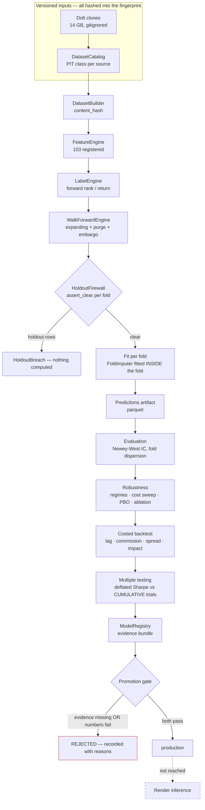
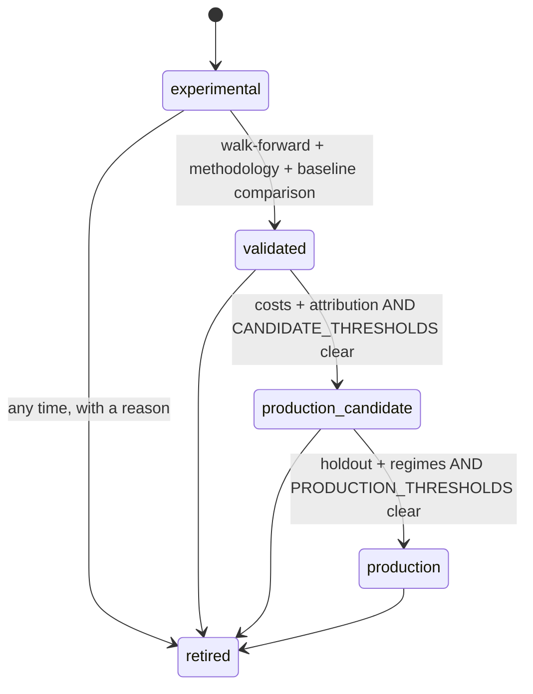
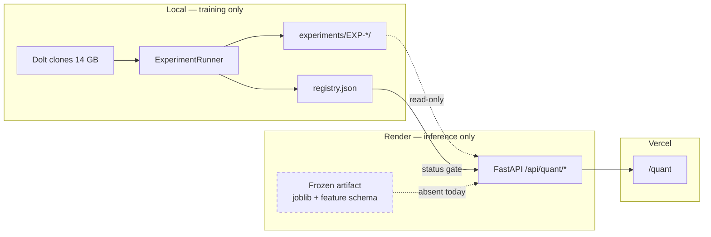
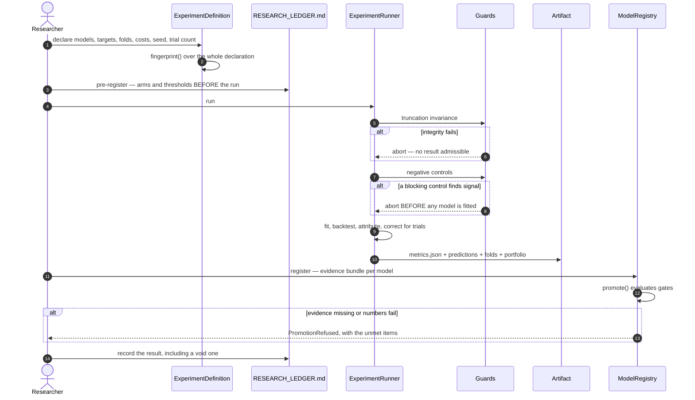

# Model Training

> Training is local. Inference would be Render. Nothing is deployed, because
> nothing has cleared the promotion gate — and the pipeline is built so that
> promotion is a registry state change rather than a rewrite.

---

## 1. The pipeline, as it actually runs

Every stage below executes today. EXP-005 ran all of it in **1h 42m** on an
Apple M4 Pro with 6 workers; EXP-006 re-ran the frozen `C_base` specification
through the same path.



**The only stage never exercised is the last one.** That is the honest state.

---

## 2. What is versioned

An experiment is a frozen declaration, hashed by `ExperimentDefinition.fingerprint()`.
Change any field and the hash changes, so a report cannot be silently
re-attributed to a different setup.

| Recorded | Where |
|---|---|
| git SHA + dirty flag | `metrics.json → git_commit`, `git_dirty` |
| dataset content hash | `dataset.content_hash` |
| dataset version id | `dataset.dataset_version` |
| source manifests (rows, dates, PIT class) | `dataset.source_datasets` |
| feature set actually used | `features_used` |
| feature families, when frozen | `experiment.feature_families` |
| target definition | `experiment.targets`, `primary_target` |
| random seed | `experiment.seed` |
| hyperparameters per model | `experiment.models[].params` |
| training + validation windows | `labels.<target>.fold_rows` |
| execution lag | `experiment.execution_lag_periods` |
| transaction costs | `backtests.<model>.config.costs` |
| benchmark | `factor_attribution` (FF5 + MOM) |
| trial count | `declared_evaluations`, `prior_evaluations`, `cumulative_evaluations` |
| dependency versions | `dependency_versions` |
| machine | `machine` |

Reproduce any study from these alone:

```bash
git checkout <git_commit>
export QUANT_DATA_ROOT=/path/to/datasets
python -m scripts.quant.local_backfill --stage all
python -m src.quant.study.run --experiment <id> --workers 6
# dataset content_hash must match the recorded one, or the panel moved
```

---

## 3. Compute

Measured on this machine, not assumed.

| | |
|---|---|
| CPU | Apple M4 Pro, 12 cores |
| RAM | 24 GB |
| Disk free | ~72 GB |
| Workers | **6** (`MAX_WORKERS`) |
| Peak RSS observed | ~7.3 GB |
| EXP-005 wall clock | 6,131 s |

### Why 6 and not 12

A previous run with 12 workers **OOM-ed the machine**. `recommended_workers()`
now sizes the pool from measured frame bytes:

```
per_worker  = frame_bytes / 1 GiB + WORKER_OVERHEAD_GB   (2.6)
affordable  = (total_gb - reserve_gb) / per_worker        (reserve 6 GB)
workers     = min(ceiling, cores, affordable, MAX_WORKERS)
```

with a hard `MAX_WORKERS = 6` ceiling on top, because the memory estimate is an
estimate and the failure mode of getting it wrong is not a slow run but a killed
one. During the EXP-005 controls the arithmetic chose **2** workers on its own —
the ceiling is a bound, not a target.

**GPU/MPS is not used and should not be.** Everything in the ladder is
scikit-learn on tabular data: tree ensembles do not benefit from Metal, and the
linear models are trivial. There is no neural model to accelerate, and adding one
to justify the hardware would be exactly backwards.

---

## 4. Model families, in order

Baselines first, always. They are the thing to beat, and they keep winning.

| Family | Members | Rationale |
|---|---|---|
| Naive | zero, historical mean | Floor. Detects a broken pipeline |
| Factor passthrough | momentum, reversal, low-volatility, earnings surprise, IV premium | Free, published, no fitting. A learned model that loses to these has rediscovered them expensively |
| Linear | OLS, ridge, ridge-strong, lasso, elastic net | Interpretable; a large gap to trees signals nonlinearity or overfitting |
| Trees | random forest, extra trees, gradient boosting, hist gradient boosting | Capture interactions without feature engineering |
| Overfit control | gradient_boosting_deep | **Deliberately over-parameterised.** Exists to prove the train/validation gap diagnostic fires — and it does, at +0.718 |

Anything beyond this — sequence models, transformers, representation learning —
is **not justified by the evidence**. Complexity is not a hypothesis. The
ablation showed that adding *data* to a 27-feature set makes results worse; there
is no reading of that under which adding model capacity is the missing piece.

---

## 5. Anti-overfitting, enforced not documented

| Control | Where |
|---|---|
| Expanding walk-forward, never random | `build_plan`; no code path produces a random split |
| Purge by label horizon | 21 sessions |
| Embargo | 5 further sessions |
| Execution lag ≥ 1 | refused in `ExperimentDefinition.__post_init__` |
| Holdout firewall | `assert_clear` per fold, before every fit; no env override |
| Imputer fitted inside the fold | hoisting it out is the leak |
| Cross-sectional ranks fitted per date | cannot leak across dates |
| No hyperparameter search | fixed defaults in the frozen definition |
| Baseline comparison | baselines in the same table, same folds |
| Costs | commission + assumed half-spread + sqrt impact |
| Multiple testing | deflated Sharpe vs **cumulative** trials |
| PBO | CSCV, degenerate configs excluded and named |
| Newey-West | Bartlett kernel, lags = ceil(horizon/step) − 1 |
| Regime floor | 200 validation dates or INSUFFICIENT EVIDENCE |
| Train/validation gap | reported per model; > 0.15 renders OVERFIT |

---

## 6. Promotion



Two independent refusals, both required:

* `PROMOTION_GATES` — does the required evidence **exist**?
* `CANDIDATE_THRESHOLDS` / `PRODUCTION_THRESHOLDS` — what does it **say**?

`CANDIDATE_THRESHOLDS` at candidacy: `|IC t| ≥ 2`, net Sharpe > 0, **gross
Sharpe > 0**, beats best baseline. An unrecorded value counts as unmet.

Current registry: **88 entries, 0 production, 0 candidates, 34 retired VOID.**
Every EXP-005 entry is eligible for `validated` and nothing beyond it.

---

## 7. Deployment, when there is something to deploy



Training never runs on Render. The 14 GB of clones are a development dependency,
not a deployment one: inference needs the artifact and the feature schema.

The deployable unit, when one exists: `joblib` estimator + feature specification
+ metadata (version, dataset hash, git SHA, seed, training window, validation
report). If it cannot be reproduced from that, it is not production-ready — which
is why `PROMOTION_GATES` requires those fields rather than encouraging them.

**A model that fails promotion never reaches Render.** `/api/quant/status`
returns `NO_MODEL` from the registry, and `/api/quant/symbol/{ticker}` returns an
explicit refusal instead of a number.

---

## 8. Experiment lifecycle



Rule that makes the rest work: **a void study stays in the ledger.** Deleting
EXP-002 would erase the multiple-testing exposure it created, and every later
significance claim is discounted against the cumulative total.

---

## 9. Adding a training job later

The architecture is ready for background jobs; nothing about it needs rewriting.

1. Add an `ExperimentDefinition` to `EXPERIMENTS` in `study/experiment.py`.
2. Pre-register it in `docs/RESEARCH_LEDGER.md` — arms, metrics, trial count.
3. Run `python -m src.quant.study.run --experiment <id>`.
4. `python -m scripts.quant.register_experiment --experiment <id>`.
5. The UI picks it up: `/api/quant/experiments` lists it, `/quant` renders it.

To make it a queued job rather than a CLI invocation, the runner is already a
pure function of its definition plus the dataset — the only shared state is the
artifact directory. A job runner would supply the definition id and collect the
artifact; no scientific code changes.

**What must not change:** the definition is frozen before the run, the trial
count accumulates across studies, and the holdout stays locked.
